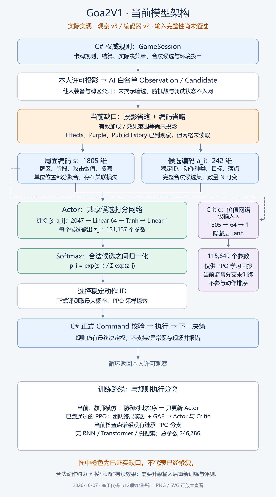

# 可见信息完整性核对与当前模型架构

结论：**当前观察v3/编码器v2没有包含玩家可见的全部决策信息，不能通过完整性验收。** 信息缺失既发生在GameView→Observation投影，也发生在Observation→1805维状态向量编码。此前完整对局合法、教学改善、Unity回放通过，只验证各自范围，不证明信息完整或模型理解所有持续效果。

用户明确要求其它角色剩余/弃置卡牌，以及本回合持续效果、已打出牌与紫卡的信息；后续优先完成这项输入基础，暂不扩大同一不完整输入下的训练规模。本文和流程图是审计交付，没有偷偷修改编码器、旧检查点或启动新训练。

## 逐层核对

| 决策资料 | 本人GameView→AI观察 | 观察→当前网络 | 实际限制 |
|---|---|---|---|
| 本人装备/牌区 | OwnCards，含牌ID/区/打出轮回合 | ID×5牌区one-hot | 打出时间未编码 |
| 他人装备、剩余牌、弃牌、已打出牌 | Players[].Cards，来自PublicCards；Selected仍掩成InHand | 队友/敌方两组的ID×牌区计数 | 牌ID可间接识别英雄，但未显式保留个体与位置/属性关系 |
| 本次未揭示的他人选择 | 不提供，包括队友 | 不提供 | 正确的隐私边界，不能为补全输入解除 |
| 紫卡身份 | Players[].Purple已投影 | **未读取** | 自己与他人都缺显式紫卡特征；个别后果可能通过候选或当次攻击数值间接体现 |
| 当前公开行动牌 | ActionSequence焦点牌→CurrentCard | ID one-hot | 只有一张焦点牌，不是完整行动队列/嵌套响应 |
| 持续效果类型/来源/保护对象/控制者/时间窗口 | Effects已做部分投影；私有来源按本人View遮蔽 | **整项未读取** | 网络不能靠这个字段区分当前/下回合效果 |
| 效果区域/半径/范围类型/豁免/击败后保留 | GameView.EffectAreas及ActiveEffect有关字段未转到观察 | 无直接输入 | 动作合法查询使用完整规则，因此眼前候选可能间接受影响，但无法代替战略状态信息 |
| 当前有效/永久属性加成 | PlayerView.EffectiveBonuses/PermanentBonuses/BasicAttackBonus/BasicAttackRangeBonus未转到观察 | 无完整明细 | 本次Attack部分算式已编码，不能等同所有角色属性已输入 |
| 中毒/石化 | 按角色投影 | 按敌我汇总 | 具体哪个角色状态未完整保留；PoisonDefense范围标志被忽略 |
| 公开历史 | 事件Kind/Card/Seat/From/To白名单；丢弃私有/Debug事件 | **PublicHistory未读取** | 公开Detail语义、序号、历史出牌时间等也未完整投影；当前无记忆网络 |
| 单位身份、位置 | Units逐个保留 | 数量/平均坐标/最近距离，以及被候选指到的目标特征 | 某些Planning局面互换两名敌方英雄位置会得到完全相同的输入 |
| 当前响应上下文 | Pending.Kind→Decision；ActiveSeat已投影 | 这两个字段未直接编码 | Phase与动作种类不能保证区分全部响应；Pending来源/目标等也未完整投影 |
| 公开行动队列 | GameView有ActionSequence | 仅焦点CurrentCard | 先后次序、父子响应和已解决标记未完整编码 |
| 动作的规则合法性 | 从正式规则查询生成完整候选 | 全部候选逐个编码，无固定数量截断 | 候选告诉模型现在能做什么，不能代替已生效状态 |
| 地图 | describe包含格位/战区/障碍 | 位置与距离、候选落点是否当前战区 | 不是完整棋盘/障碍分布编码；候选合法性由核心保障 |

该表是本轮查明的重要缺口，不是对全部GameView字段完成逐项语义等价证明。调试字段、连接状态、UI标识和其他非玩法信息不应机械传入模型；同义、静态可查的信息可以复用稳定内容表，但必须记录映射与版本。

## 可执行的证据

`tools/audit-ai-observation.py`读取已经归档的真实公开Planning输入，保持候选列表固定，逐项改变观察字段，比较完整状态张量和全部候选张量。它不造一局伪造规则游戏，不提交这些变更，也不读取权威存档。

12项探针：本人牌区、他人牌区、当前公开牌3项变化会改变输入；自己紫卡、他人紫卡、中毒防御范围、出牌时间、公开历史、持续效果、ActiveSeat、响应种类、敌方身份与位置关联9项变更仍得到完全相同的输入。输入完全相同时，任何现有Actor权重都不能在这两个输入间做不同推理；这比“模型可能没学好”更基础。也不反过来声称张量改变就证明模型学懂。

同一动作集下的差异是诊断设计，不能据此说这些信息在每个实际局面都毫无间接影响。效果改变时规则可能生成不同候选，防御/攻击查询也可能给出不同数值；这些只覆盖部分即时结果。

```powershell
.venv-ai/Scripts/python.exe tools/audit-ai-observation.py --output artifacts/ai/new-observation-audit
python tools/draw-ai-model-architecture.py --audit artifacts/ai/new-observation-audit/report.json --output artifacts/ai/new-model-diagram
```

第一条用独立AI环境，第二条使用本机已有matplotlib/中文字体绘制技术图，没有安装新包。探针退出成功只表示复现了预期缺口，报告始终`complete:false`，不是输入完整性通过。首次探针把英雄8级与卡牌内容Level混淆而未找到紫卡，已改为公开PrimaryFamily=ultimate和HeroId匹配；没有改游戏规则。

## 当前模型结构（已实现）



[SVG矢量图](../verification/ai-observation-audit-20261007/current-model.svg) · [原始审计报告](../verification/ai-observation-audit-20261007/report.json)

Actor对每个合法候选拼接状态1805维和动作242维，经过Linear(2047,64)→Tanh→Linear(64,1)，共131137参数；所有候选共享权重。Softmax在本次合法候选间归一化，推理选最大概率；PPO采样时按分布抽样。动作ID稳定，不把候选下标作为长期含义。

Critic独立Linear(1805,64)→Tanh→Linear(64,1)，共115649参数，总246786。当前监督分支只训练Actor，Critic没有胜负训练，不参与选择，也不能当可靠胜率。此前PPO分支运行过，但没被当前监督检查点继承。无RNN、Transformer、图网络或搜索。

## 输入补齐的实施与验收要求（尚未实现）

1. 在本人许可View基础上扩充版本化白名单：逐角色公开牌区/打出时间/紫卡、公开有效与永久加成、效果与作用范围/时间窗口/对象/豁免、决策上下文和公开行动序列。处理私有来源时继续遵守现有遮蔽，不复制原始Pending/完整存档或Debug字段。
2. 编码中保留角色—卡牌—单位位置—效果的关联。可使用实体集合/显式关系结构；不能仅把整队数值做平均。新增类型、容量和不支持字段明确失败，不静默丢失。是否引入注意力或公开历史记忆应另行验证，不把架构名字当作完整性保证。
3. 建立字段清单，说明每项是直接编码、等价派生、稳定内容查询、非决策字段或隐私排除。新增View/DTO字段时要求补清单和测试，不能默认忽略。
4. 对投影与编码分别做变化测试：持续效果增加/到期、同牌不同生效窗口、紫卡和永久升级改变、弃置/取回、控制者/目标更换，网络输入必须保留所需区别；不要求旧权重立即懂得最佳动作。保留新机制未知/超容量拒绝与候选顺序不影响语义测试。
5. 同时做隐私不变性测试：改变他人/队友未揭示选择和私有来源、RNG状态、Debug字段，不得改变不该变化的本人输入。动态效果区域复用C#公开规则查询，不在Python实现卡牌规则。
6. 观察/编码器升级后拒绝旧检查点直接加载，或另做明确权重迁移并重新训练/评测；旧录像与报告保留原版本。先复核信息完整性，再扩展训练规模与正式盲测。

仅修改AI观察/编码器也会改变模型合同，须明确标注；若发现必须改共享GameView或网络投影，单独列出范围后推进。此次只新增审计、流程图和说明，不改共享Command/View、规则、网络、存档或GameScreen，不修改旧模型。
