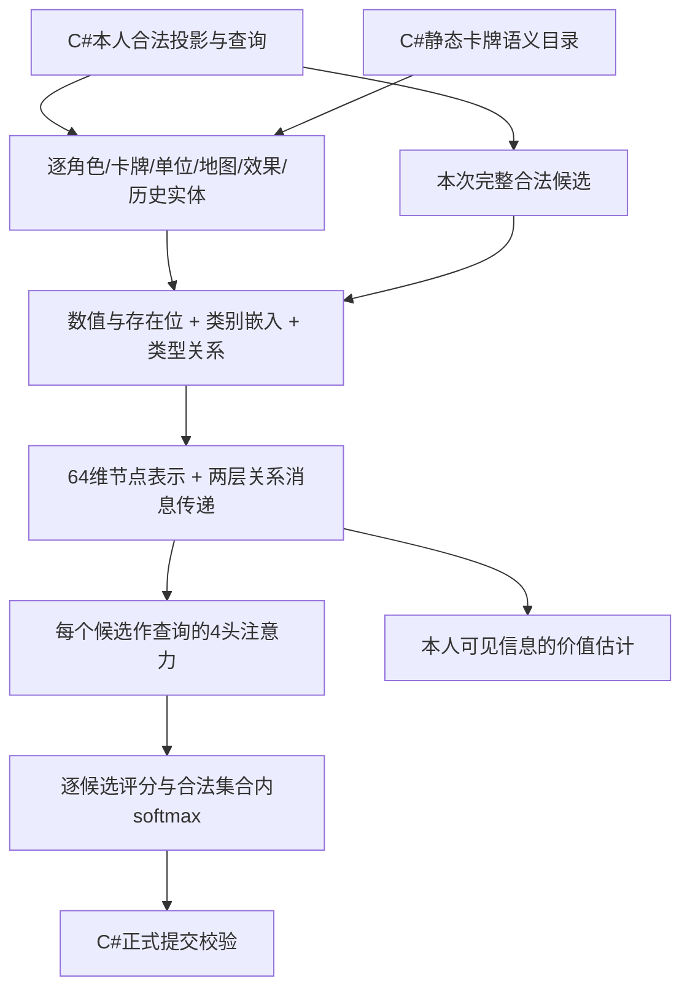

# AI数据语义与模型候选（2026-10-08）

本批实现提交 `89deb474`，工作树 `Goa2V1-ai-training`，分支 `feature/ai-training`。先补当前六英雄108张卡牌的输入语义，再调研模型；没有开启长训，没有新的棋力提升结论。

[手机入口](../verification/AI手机查看.md) · [测试与实测证据](../verification/AI数据语义验收-2026-10-08.md) · [108张卡逐牌目录](../verification/ai-semantics-20261008/catalog/README.md) · [156项类型化字段中文表](../verification/ai-semantics-20261008/validation/input-fields.csv)

## 数据语义已经补到哪里

当前合同是观察5、行动2、编码器4、卡牌语义1，规则仍为engine98。目标是把“谁拥有什么、哪里发生了什么、什么条件何时起效、谁需要作出选择”明确交给策略。Python不执行卡牌程序；候选仍由C#查询产生，提交仍走正式校验。

上一版已有逐角色资源、精确单位位置、逐张牌区、时间、地图和效果实例。本批补上此前确认缺失的三组信息：

| 新信息 | 含义及来源 |
|---|---|
| 静态卡牌机制 | 从C#实际注册程序导出适用参数、有序步骤、规则约束；108张均与当前ID、牌文和规则版本精确绑定 |
| 步骤和持续效果定义 | 57种步骤说明操作、选择者、目标、条件、是否可选及无目标行为；24种效果说明操作、目标、适用条件、取样时点及数值 |
| 历史、算式和限制 | 补公开事件原因、历史攻击算式及支援/守卫来源、本人允许看到的私有历史、当前技能/防御限制及效果生命周期关联 |

卡牌机制现在包含43种实际使用的参数键，例如移动距离、取回区域、推动是否定距、目标条件、攻击加成来源、效果持续期、紫卡触发和基础攻击加成。参数表里的“43”是键种类数，不是每张牌都有43个数，也不是新增加43个固定全局槽位。

**参数不等于正在生效的效果。** 静态目录说明这张牌可以做什么，牌实例说明它在哪里、什么时候打出，效果实例说明什么已经生效。内部程序给无关分支填的默认攻击/换位/放置/推动/效果参数已剔除。剩余参数也只在相应步骤适用；不能把默认0距离当作一次正在发生的移动。

例如：

- 意念黑洞保存两个独立的重复步骤及次序，不能用集合去重成“可以重复一次”。结束重复会停止余下次数。
- 毒效果说明不叠加、轮末清除、来源击败/取回不自动解除；当前中毒状态和是否影响防御分别记录。
- 洪水说明主要/次要/快速移动在起点检查限距；牌文内部移动不直接套用同一限制，持续期不跨轮。
- 死亡缠绕说明动态相邻、实际移动来源牌的颜色例外，不能用“目标自己的金牌”替代他控移动的来源。
- 石化保留英雄身份；最近目标先算距离和并列，再检查免疫，整段移动结束后重算。
- 紫卡有触发步骤、静态加成和约束；是否真的触发及其结果还要看公开事件与当前状态。

这些规则条件在模型里是稳定类别，不是英语自然语言推理。嵌入向量必须通过数据学习其作用；“提供了机制”不代表模型立即理解新牌。中文牌文保留在人工核对目录，未把名称、UI文字或卡牌程序内部ID当作长期语义。

## 原子记录、关系与合法信息集

逐角色保留金币、等级、永久/有效属性、装备、复活及状态；逐单位保留英雄/三种小兵的精确格、阵营和所属角色。出生点、兵线、障碍、基地属于静态地图事实，即使在单张地图上不变，也用于区别地图和规则配置。没有重新加入队伍手牌总和、单位位置均值或最近敌人距离。

一张装备牌只存一个角色所属实例，连到共享卡定义；已打出的轮次和回合仍保留。当前牌区与旧公开历史可以同时存在：前者是现在，后者是发生过程，并非重复计算一个队伍统计。当前攻防总值及来源分解保留，因为它们是正式规则查询结果，能减少模型自行重算规则的负担；后续可做消融，不能在无证据时先删除关键条件。

历史分为 `PublicHistory` 和 `OwnHistory`。本人防御计算、本人选牌等已经获准看到的事件可以进入后者；其他席位私有事件在解析前就被丢弃。同队也不绕过现有本人投影。所有已装备技能身份按现有公开规则提供，他人当前未揭示选择继续投影为手中，不能由内部采样顺序推断。

公开流和本人流分别连续编号；本人事件用 `AtPublicOrdinal` 表示它发生在第几个公开事件之后。内部事件序号、命令ID、随机数状态、恢复游标、投币内部ID都不输入。效果内部ID也只转换为局部连接键，用来把“施加—取消”和当前效果连起来；改写该内部ID不会改变策略观察。

数值用固定线性尺度，缺失值有独立存在位，不裁剪大生命/推进数。标识和引用不作为大小有意义的数值。集合的排列不应影响判断，路径、结算步骤、事件则保留顺序。未知字段、词表、事件原因、卡牌绑定以及超容量均明确失败，不能静默忽略。

当前图容量为16384节点、262144条有向边、200万候选×节点配对。测试样本最大3525节点、12484边、175候选。可变长度表达不等于已支持任意人数或无限对局；环境目前显式支持四席。

## 当前模型接线

结构仍是上一批关系图基线，参数因新语义增加到105810。每节点18个数值/存在性槽和8个类别槽是统一容器宽度，并非整局固定只有26项信息；实际每种记录有自己的槽含义。完整字典有156项“记录类型×字段”及118种有向关系。它不是线性层加tanh，也没有本批新增的循环记忆。

## 完整性的准确结论

当前目录已导出；已发现的牌文程序、事件详情、历史算式和限制字段缺口已补齐并接入编码。15种核心公开结构字段及3种卡牌程序的字段清单受回归保护；新增字段需要重新审查。

`complete_information=false` 仍然保留。有限场景通过不构成所有可达局面的信息集等价证明，也不能把未知新机制自动转成已理解能力。尚有明确边界：Q-09三张偷金币牌的最后“如可行移动”沿用现有引擎，U-017安全放置的障碍解释待裁定，D-050地图标志物尚未加入当前内容。它们没有被本批擅自裁定或改成别的单位。长历史尚未做经过验证的学习压缩。

初始水晶生命、推进阈值、每轮回合数、手牌规模、初始战区均进入规则记录。但新配置仍要单独验证和训练/评测；旧检查点默认拒绝合同不匹配。支持数值输入不等于已证明跨规则泛化。泉水胜利规则未改变。

## 模型候选：截至2026-10-08的判断

优先比较**当前关系图基线、小型实体注意力/Perceiver式网络，以及它们带GRU记忆的版本**。选择依据是实体关系、可变候选和历史长度，不按论文新旧排序。下表是后续实验建议，并未实施新架构。

| 候选 | 适用位置 | 本项目判断 |
|---|---|---|
| 当前GNN＋候选注意力 | 当前局面、关系、合法候选评分 | 留作可运行对照；两层关系传播能否学足复杂组合需测试 |
| 小型实体Transformer/Perceiver式网络 | 角色—牌—地图—效果间的全局交互 | 第一优先；先试关系编码后接32–64个潜在槽、96–128宽度，避免对数千节点直接做全量自注意力 |
| GRU/LSTM事件记忆 | 本人/公开历史的递推表示 | 第一批记忆对照；容易在现有PyTorch实现，但不能随意打乱序列训练 |
| Gated DeltaNet | 更长的事件历史和可更新记忆 | 第二梯队，先验证历史长度确实成为瓶颈 |
| Mamba-3 | 状态跟踪和流式历史记忆 | 研究候选，当前Windows依赖成本较高，不能直接替代空间实体建模 |
| CAT压缩注意力 | 历史压缩和推理计算预算调整 | 研究候选，要检查压缩是否丢失规则关键时点 |
| DreamerV3 / EfficientZeroV2 | 学习世界模型、想象或搜索 | 后置；本项目已有准确C#模拟器，先证明预测误差和搜索收益值得额外复杂度 |

Perceiver IO用潜在表示和查询接口处理不同规模的输入输出。这里把“合法候选”当查询是工程方案，尚无本游戏胜率证据；若直接压缩把某个关键效果关系抹掉，也可能不如当前图模型。[原论文](https://arxiv.org/abs/2107.14795)

Gated DeltaNet结合遗忘门控与delta记忆更新；论文提供检索、长上下文等任务结果，ICLR 2025。它是序列模块，不自带本项目的合法行动、多智能体分派或PPO。作者实现推荐FLA；当前FLA安装说明要求PyTorch至少2.7，而本环境是2.5.1，不能当作已可直接安装。[论文](https://arxiv.org/abs/2412.06464) · [作者代码](https://github.com/NVlabs/GatedDeltaNet) · [FLA安装说明](https://github.com/fla-org/flash-linear-attention/blob/main/INSTALL.md)

Mamba-3于2026年3月公开，ICLR 2026，改进递推、复数状态更新和多输入多输出计算；论文证据主要是语言、检索、状态跟踪。官方模块实际依赖Triton，部分路径涉及TileLang/CuTe；仓库主要支持Linux环境。本机Windows、471.51驱动与现有PyTorch组合尚未验证，不能据显卡型号承诺可直接运行。本批未为它安装新环境或改驱动。[论文](https://arxiv.org/abs/2603.15569) · [官方仓库](https://github.com/state-spaces/mamba) · [实际模块](https://github.com/state-spaces/mamba/blob/main/mamba_ssm/modules/mamba3.py)

CAT是《Controllably Efficient Language Models》中的Compress & Attend Transformer；2026年7月修订版仍标为预印本v2。它通过分块压缩和注意力调节推理成本，适合研究“同一模型不同预算”，但语言实验不能证明本游戏难度随预算稳定提高，更不能允许压缩丢弃未到期效果或重复次数。[论文v2](https://arxiv.org/abs/2511.05313v2)

DreamerV3通过学习世界模型进行想象训练，EfficientZeroV2也是模型式学习/搜索路线。它们值得关注，但本项目的不完全信息、同时暗选和精确卡牌规则仍需独立处理。Dreamer官方实现采用JAX，说明测试环境为Linux/Mac；不是替换当前PyTorch网络一个类就完成接入。真实C#模拟器的分支搜索也必须从合法信息构造假设，不能偷看真实对手暗选或未来投币。[DreamerV3论文](https://www.nature.com/articles/s41586-025-08744-2) · [代码](https://github.com/danijar/dreamerv3) · [EfficientZeroV2](https://arxiv.org/abs/2403.00564)

GAN/GAIL与上述实体网络不是同一层级的选择：前者涉及生成/对抗模仿目标，后者决定怎么表示局面和历史。没有高质量专家对局数据时，优先更换成GAN不能解决策略奖励和规则记忆问题。

## 怎么选，而不提前宣布胜者

训练方法继续分开评估：少量合法教学用于基础动作，PPO用于团队胜负与历史对手池；网络先控制在约0.1–1M参数的候选范围。先固定局面，再固定阵容完整对局，最后跨阵容/升级/规则配置。0.1–1M是提案，不是本机已测最佳参数量。

1. 相同可见信息、教学样本、环境步数、对手池和留出种子，比较图网络、实体注意力和记忆版本；同时记录相同墙钟预算下的结果。
2. 建立成对语义探针：仅改变效果到期、弃牌时点、实际选择者、取回区域或重复剩余情况；也检查改变他人暗选、内部ID和实体排列时的应有不变性。
3. 教学训练/验证按整场对局或场景来源分组，同一局的换视角和相邻状态不能跨集合。正式完整对局胜率与教学命中率分开。
4. 记忆按“比赛×席位”隔离；只接收该席允许的事件，开新局清空。训练必须有序列切片、预热历史、正确截断bootstrap和检查点状态恢复，不能把旧PPO的随机独立样本循环直接套上GRU。
5. 固定种子换边，至少多个训练初始化种子；报告置信区间、截断、非法/异常、延迟和资源。对随机机器人更强只是一项基线结果。

2026年更新的POPGym Arcade研究展示了记忆强化学习中的无关历史信用分配和分布外历史污染问题，因此这里需要受控的记忆探针，而不是“有记忆一定更强”。[论文v8](https://arxiv.org/abs/2503.01450v8)

现成库也不能机械拼装。当前SB3-Contrib的MaskablePPO文档明确不支持循环策略，RecurrentPPO是另一实现；本项目又使用变长候选评分，不能把两个开关相加就称为已兼容。当前先保留经过测试的自有候选PPO，再单独实现和验证序列训练接口。[MaskablePPO文档](https://sb3-contrib.readthedocs.io/en/master/modules/ppo_mask.html) · [RecurrentPPO文档](https://sb3-contrib.readthedocs.io/en/master/modules/ppo_recurrent.html)

实测输入编码中位20.90ms，前向8.03ms。先缓存版本化的静态原始张量/拓扑、避免每步重复构造，可能比换新架构更直接；训练时不能把需梯度的嵌入结果永久缓存。该优化与上述架构对照尚未实施，也不自动开始1小时、8小时或24小时训练。
