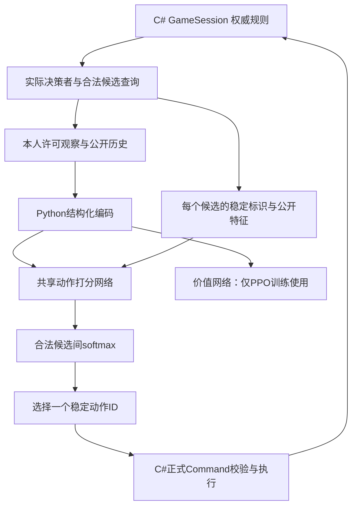

# 当前AI训练方法与模型原理

本文说明实际代码，不把规划中的功能当作已实现。当前是本机运行的小型候选动作网络，246,786个参数，不调用大语言模型或收费API。它能通过正式规则完成对局，但只获得有限的教学改善，整体策略还弱。

## 1. 规则与学习的分工

C#处理移动、卡牌、攻击/防御、复活、升级、胜负与随机投币。Python不实现卡牌规则。无画面投币由环境执行并记录，策略不能指定落面。环境按真实响应者分派，不能用ActiveSeat替代所有决策席位。

策略输入是专门的Observation和Candidate DTO；权威存档、调试字段、未揭示选择和RNG内部状态不作为策略输入。其他玩家装备牌身份依项目公开规则可见，但本次暗选仍保密，同队未揭示选择也不加入观察。训练输出目录的权威记录用于复现；这属于软件数据流隔离，不是针对恶意本机Python的操作系统文件权限沙箱。

“合法”是规则允许提交，未必意味着“明智”：防不住的牌也可能合法，放弃、零收益主要行动也可能合法。必须由学习器理解区别，不能从候选中偷偷删除合法差招来伪装学会策略。模型选择仍经过正式Execute验证；不支持的决策/容量明确失败并保存现场。

## 2. 模型到底看见什么

目前编码器v2要求观察v3、动作v1及完整兼容合同。状态向量1805维、每个候选242维。

- 状态：阶段、轮/回合、双方水晶生命和推进标记、目标阈值、公开等级/金币/手牌数量/状态、自己位置；双方单位数量与平均位置；本人牌区、他人公开牌区、当前公开行动牌、公开攻击算式和最近敌人距离。
- 动作：命令类型、稳定卡牌ID、稳定分支值、目标单位类型/队伍、目标或落点位置/距离、当前战区关系、牌面公开数值、规则给出的SuccessfulDefense与ImmediateSkip。
- 生命和推进目标同时保留绝对量、相对剩余量和目标本身，避免把7血与10血误编码成完全相同的初始状态。

并没有读懂全部中文牌文；编码后的公开历史和复杂持续效果仍不完整。地图没有经过图神经网络，单位位置也有聚合损失；目前不带记忆。实际接口目前明确限定四席，单位种类/稳定值长度等不支持时拒绝，不能宣称支持任意人数或新英雄。卡牌ID字典及内容哈希固定，因此新增内容需要明确更新编码与模型。

## 3. 网络如何选动作

对当前状态s和每个合法候选a_i，拼接其特征：

`z_i = Linear64→1(tanh(Linear2047→64([s, a_i])))`

每个候选用同一组权重。z_i是偏好分数，经softmax得到概率：`p_i = exp(z_i) / Σ_j exp(z_j)`。训练PPO时按概率抽样探索；正式评测固定取最大概率。没有“第17个按钮永远代表攻击”这样的含义；动作顺序改变时每个稳定ID的分数不变（并列分数的argmax次序仍可能影响选取）。

例如旧模型在同一个虎爪防御局面选择tigerclaw-02，防御3对攻击5；防御微调后选择tigerclaw-18躲闪。所有候选仍在，差异来自权重；两次选择分别提交C#并由Unity重放核验。

actor为131,137参数；critic是1805→64→1的独立Tanh网络，为115,649参数；总246,786。critic预测未来折扣团队回报，不是严格校准的胜率，也不参与当前部署动作的直接排序。当前无树搜索，没有额外模拟几步再选招。

## 4. 已实际用过的三种学习方法

### 合法随机与简单策略

随机基线在全部合法候选中均匀抽样。simple-v1是公开启发式：优先成功防御、可产生效果的主要行动、部分小兵目标和接近战区的移动；按距离与牌面值选牌。它可作为基本教师和固定对手，但没有证明这些偏好在所有局面最优。

### 模仿学习与对比微调

从真实规则场景前缀/训练轨迹提取本人观察、全部合法候选及教师偏好；每个教师标签都在C#新环境中真正提交验证。相同来源家族放在同一训练/留出集合，避免相邻前缀跨集合。多种同样受偏好的动作保留为集合G，损失是`-log(Σ_{i∈G}p_i)`，不会处罚另一种并列正确答案。

先有200批×32的模仿预热。随后防御微调用1255训练行、514留出行，每批16个一般模仿加16个防御排序，固定300批。排序损失`mean softplus(2 - (z_good - z_bad))`，鼓励规则明确能抵挡的候选分数高于不能抵挡的候选。good标签只来自规则查询，不用Python重新算攻防。

这并不证明每次都该花牌防御：保牌与牺牲的长期取舍仍要用完整对局检验。监督微调只改变actor，没有给critic虚构胜负标签。300×32=9600次抽样含大量重复，不能报作9600条新对局数据。

本次后续将一般Action细分，固定每批8一般模仿、8防御排序、8普通移动、8选牌，300批。父模型来自上一批defense；保持完整候选，继续监督学习，不是新增PPO。见选牌走位短试文档。

### PPO强化学习

已经跑通自定义PyTorch可变候选PPO，不是直接拼接SB3 MaskablePPO、循环网络与多智能体插件。学习席按概率执行候选，收集观察、动作、旧概率、价值、团队奖励、下一价值和边界。

真正获胜+1，失败-1，其余0；没有刷金币、伤害或走路就加分的中间奖励。步数上限是截断，不是判负；真终局的下一价值为0，截断仍保留价值估计，并在局间切断优势递推，防止下一局收益串入上一局。

GAE用gamma=.99、lambda=.95估计某一步比原先预期好多少。PPO用新旧动作概率比r更新：`min(r*A, clip(r,.8,1.2)*A)`，限制一次改得太猛；另训练critic拟合折扣回报，加.01熵项保留探索。Adam学习率.0003、batch32、最多3遍、梯度范数.5；近似KL>.03提前停止本轮更新。

当前PPO只学习固定阵容的黄蜂席，换边为座位0/1，另外三席冻结simple-v1，BP固定。不是真正多智能体自博弈；历史模型对手池、联合团队训练和记忆策略尚未实现。

## 5. 当前模型谱系与证据怎样解读

早期旧编码PPO接线共657学习步。新编码阶段从随机网络开始：200批模仿后另试206个PPO学习样本/21次优化更新；该PPO分支正式评测没有改善，因此防御模型从模仿warmup权重开始，未继承那个PPO分支。

当前权重谱系：随机初始化→模仿预热→防御监督微调→选牌/移动监督实验。PPO曾运行成功，不代表当前改善是PPO造成的。

防御批：留出有效防御12/16→16/16；整体教学75.49%→81.91%；新21001/21002换边四局从0胜4负到1胜3负。全部8局真正结束、0非法/异常。游戏中遇到的机会不同，不能把不同轨迹直接当同局面比较。16窗口来自若干相关机制，不能当16个独立机制；四局也不足以可靠估计胜率。

教学命中上升只是更像这个简单教师。完整对局输赢检验长期策略；不同种子/换边、不同对手和规则配置才能进一步检验泛化。旧留出数据已用于指导下一批方向，后续只称回归集；需要新的未参与开发的正式评测。

## 6. 更多水晶生命、更多推进次数怎么适应

接口已有生命和推进标记目标；C#可生成独立规则配置包，默认7生命/3标记与10生命/4标记均有基线完整局验证。但当前模型合同仅覆盖默认配置，加载变体会明确拒绝；不能因为向量有字段就声称模型已理解新规则。

下一阶段应明确训练配置集合，按配置分组采样，单独保留未见过的组合；检查完整结束、回放、收益目标与步数预算，再评测每个配置。模型清单记录训练范围与验证范围。新增机制/单位/人数需要重做相关编码和覆盖验证，必要时明确迁移权重，不能放开所有哈希自动通用。

现有泉水胜利条件独立存在，因此提高FrontlineVictoryMarks并不强制所有获胜路线多推进。如果需求是“必须推进更多次才能结束”，还涉及地图/泉水规则裁定，本批不擅自修改。

## 7. 本机资源与下一步

本机5900HX、RTX3070 Laptop 8GiB、约16GiB系统内存。GPU前后向与整局推理曾通过，但进程树占用使系统可用内存触发4GiB余量线；当前CPU两线程、一个规则环境，无长训或付费服务。小模型不代表GPU端到端必然更快，规则执行和JSON/逐候选处理也占时间。

下一步先用新种子确认选牌/移动教学是否改变真实结果，再判断需要更好的公共特征、短搜索或更有质量的教师。防御回归与正式完整评测保留；之后才扩大英雄、紫卡、对手池和参数规则课程。Unity实时推理、玩家对战机器人、实时观战及推理超时/异常兜底仍未接入，现有Unity仅重放已记录命令。

源码入口：ai/Goa2.Ai/HeadlessEnvironment.cs、Protocol.cs、Baselines.cs；ai/trainer/policy.py、train.py、curriculum.py、defense.py。实验清单与实际测量以各次verification文档为准。
