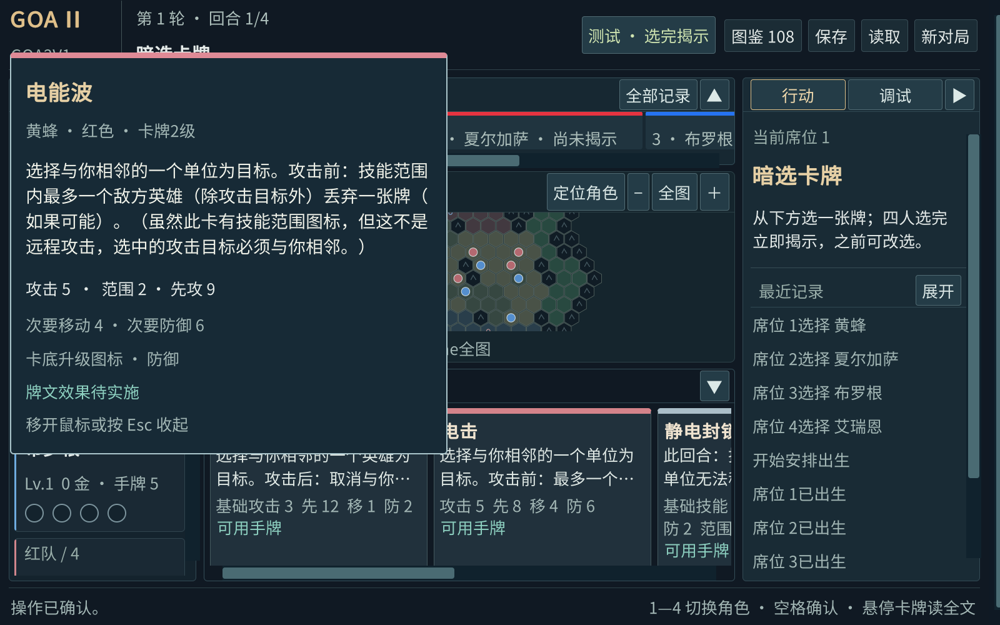
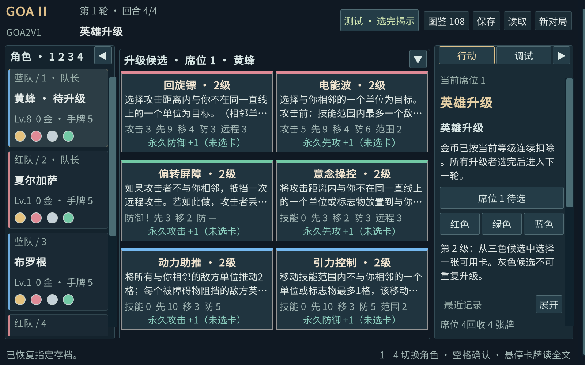

# 界面组件名称与卡牌阅读

以下是Goa2V1项目内统一采用的正式组件名称。它们描述电子版界面，不代表桌游出版方为这些界面组件规定的名称。后续需求、缺陷和验收统一使用本表。

| 位置 / 当前显示 | 正式名称 | 功能 / 子组件 | 程序标识 |
|---|---|---|---|
| 顶部GOA II、轮次与阶段、保存等 | 对局状态栏 | 项目标识、轮次回合指示器、阶段指示器、全局工具栏 | match-header |
| 左侧“角色 · 1 2 3 4” | 英雄栏 | 四张英雄状态卡；席位、队伍、等级、金币、永久加成、四个出牌槽、弃牌标记、紫卡标记 | hero-roster |
| 英雄栏下方水晶、决策币、战区、推进 | 队伍状态区 | 双方公共资源与胜负进度 | team-status |
| 中央上方“已揭示牌” | 揭示区 | 当前保留的公开出牌，按有效先攻排列；队伍条、牌色条、描述预览 | revealed-zone |
| 中央六角地图 | 战场区 | 地图画布、单位、合法目标高亮、定位与缩放控件、地格提示 | battlefield-map |
| 中央下方“手牌” | 手牌区 | 当前席位的五张普通牌、状态、数值、绿色加成与描述预览 | hand-zone |
| 升级期间中央三行候选 | 升级候选区 | 三色各两张，已使用颜色禁用；8级显示唯一紫卡 | upgrade-zone |
| 右侧“行动 / 调试” | 操作面板 | 行动页签、调试页签、当前选择说明、确认区 | operation-panel |
| 操作面板中的“最近记录” | 最近记录区 | 最近12条事件、展开按钮 | recent-event-log |
| 最底部提示与快捷键 | 操作提示栏 | 操作结果、错误提示、快捷键说明 | status-bar |
| 悬停卡牌出现的大卡面 | 卡牌阅读浮层 | 完整原文、数值、适用的永久加成、卡底升级图标、实现状态 | card-preview |
| 点击“图鉴108” | 卡牌图鉴 | 六颜色行、英雄筛选、文字搜索、实现状态筛选 | RenderGallery |
| 揭示区的“全部记录” | 出牌记录窗口 | 按英雄展示已公开的历次出牌 | RenderPublicCards |
| 最近记录区点击“展开” | 对局日志窗口 | 每轮一页的完整可见事件，可翻页 | RenderHistory |

“出牌记录窗口”只看出过哪些牌；“对局日志窗口”还包含行动、防御、弃牌、升级等事件。以上两处用途不同。

2026-09-12补充：揭示区中卡牌颜色条位于卡牌顶端，队伍颜色条位于卡牌底边；没有公开牌的空位不显示这两个条。新一回合暗选期间按D-020保留上一组已揭示牌及其队伍条。修正后的截图、独立程序启动限制及验证方式见[队伍颜色条修正验收](../verification/队伍颜色条修正验收.md)。本文下方的卡牌阅读截图和结果属于2026-09-11版本历史证据。

## 卡牌阅读方式

手牌、揭示牌和升级候选把描述预览放在牌名下方，先读效果，再看数值。预览最多两行；长文本用完整阅读浮层查看。悬停约0.2秒即可展开，保留26像素以上文字，完整牌文使用28像素，不用滚动卡牌内部。移开鼠标或按Esc收起。

完整阅读同样适用于图鉴、公开出牌记录和操作面板内的卡牌详情。浮层展示正式内容源原文；未实现的效果明确标注“待实施”。浮层不接收鼠标点击，因此悬停后仍可正常选牌，未产生选牌、确认或其他游戏命令。

手牌和揭示牌按横向卡列浏览；卡多时使用底部横向滚动条。右侧详情取消了卡牌内部的独立滚动框，正文随操作面板排版。小窗口可以滚动外层工作区，牌文阅读浮层始终约束在实际窗口内。

## 本次验证

实际键鼠脚本：`./tools/test-card-reading-ui.ps1 -Width 1600 -Height 1000`；小窗口可改为`-Width 1280 -Height 800`。检查牌面描述、完整原文、可见边界、字号、Esc、悬停不提交命令和移除内部滚动框。旧版实际Player先失败的报告保留在artifacts/unity/card-reading-ui-1600x1000-20260911-032028.json。

逐牌布局脚本：`./tools/test-card-layout.ps1 -Width 1600 -Height 1000`。可加`-Visual`查看过程，或改为1280×800。它在真实Player面板上发送合成悬停事件，逐张核对108张牌的正式全文、字体测量高度、窗口边界、无内部滚动和不提交游戏命令。结果在artifacts/card-layout；隐藏窗口的图像可能是黑色，以布局报告为准，需要截图时用`-Visual`。这不等同于真实鼠标键盘验收。

本次结果：两种窗口各108张全文布局通过；1600×1000三行六候选的完整边界均在可见区域内；资料保护32项通过；最终Windows包独立解压运行20步通过。阅读组件和样式在逐牌验证后未改动，最后仅紧凑了升级候选的数值行，并单独检查实际升级区截图。引擎保持9，具体牌效数量未变。

真实鼠标/键盘脚本在提交点击前被Windows前台焦点限制阻止，尚未完成；没有把合成事件当作实际鼠标、空格或Esc通过。旧版“手牌无描述”失败报告和前台限制报告均保留。精确文件与SHA256见[卡牌阅读优化结果](../verification/卡牌阅读优化结果.json)。

新版程序：[Windows卡牌阅读优化包](../../artifacts/releases/Goa2V1-e9-card-reading-20260911-034427-e77aac35.zip)。包SHA256为`4931015e618245b4abae249e5faaadaeffa914cd0352c9b8eb0e1c49ee3554e7`。

