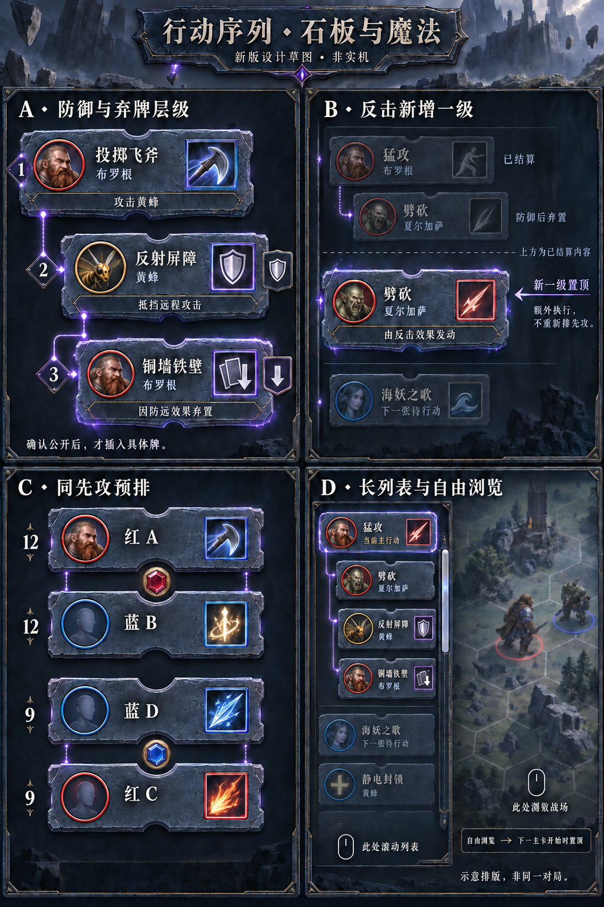

# 石板行动序列：新版草图与边界处理 · 2026-09-29

状态：设计整理与概念图，未实现运行时，未制作demo或视频。素材使用内置image_gen生成与修订；不安装外部软件。本文件优先于旧木板/实体链条方案；石板与魔法是本轮供用户评估的方向，不冒称美术已经通过验收。

## 图的阅读方式

- A：攻击牌一级，实际使用的防御牌二级；该防御效果导致的具体弃牌三级。盾牌/弃置图标是用途标识；底部记录做了什么。
- B：夏尔加萨此前已开启反击；布罗根攻击完整结束后，她实际选用的《劈砍》另起一级，不继续嵌套在防御节点下。进入该一级节点时置顶。上方暗区与虚线是历史/可视区示意。
- C：两个各含红蓝的同先攻组，按当前币色预排红蓝/蓝红；组内浮币与凹槽同心，异先攻组之间没有币。
- D：窄栏滚动区域与战场区域分开，当前一级开始时置顶，自由浏览期间可上下查看。

四格是独立说明，不是一场连续对局。A是防御分支局部示例：非相邻远程攻击满足反射屏障条件；投掷飞斧可能需要的攻击前增距弃牌不在这张局部图内。B沿用之前确认的猛攻→劈砍防御→反击用劈砍示例。C的红A/蓝B等与数值是匿名布局示例。D只示意排版，不意味着图内这些牌构成合法连续响应。

大标题、A—D、层级数字、箭头、虚线和说明文字仅为设计注释，不默认加入成品界面。生成图的角色头像、技能插画不是正式英雄形象，角标颜色不作为卡色权威；实现时读取真实卡牌颜色与数值。右侧鼠标区表达的是滚轮缩放战场，以本文交互规定为准，概念图细字不作为实现文案。

## 已确认的内容结构

1. 全部卡牌节点都必须有具体实际卡牌；没有卡牌的操作不生成假卡。牌名/图标、英雄/队色、卡色、用途图标及底部执行记录构成内容。先攻只用于普通主牌排序；额外反击卡不参与先攻重排。
2. 防御牌不论牌面主要类别，都作为二级并加防御图标。其自身使用后进入弃牌堆更新原节点，不再造一张；防御效果导致别人弃牌，实际弃置牌作为该防御下三级。
3. 同一张实体牌可多次出现在历史中，展示层级/上下文及执行摘要区分，不要求额外“第几次使用”标签。内部实例ID仍唯一。
4. 反击保持D-044：等导致弃牌的完整行动结束才执行。到实际选择并开始使用攻击牌后新增一级，置于已完成原行动之后、下一普通待行动牌之前。后续防御在它下面二级。不能提前放未知反击牌。
5. 揭示后先按有效先攻与当前决策币预排；同队具体人选仍由合法队长决定。中毒变化只调整未行动区。预排币不消耗真实币，额外反击不翻先攻决策币。
6. 切换下一一级执行节点时退出自由浏览并将其置顶；仅信息栏及明确边缘热区的滚轮滚动列表，其他区域缩放战场；列表到头不透传滚轮。

## 石板与魔法的表现建议

板面用蓝灰石材、暗色边框和少量嵌金，文字区域减少裂纹。用稀疏魔法线表示父子关系；每条线从真正的父卡连接到子卡，不把三级误画成二级兄弟。常态连接线安静，只有正在执行或新插入的连接点明显发光。

不用实体链条解扣：换序时石板边缘符文充能，板前浮、邻板后退让位，沿短弧滑入新位置，落定伴随薄光环与少量碎屑。插入支板则先腾出空间，魔法轮廓成形再凝实为石板；不能提前出现空槽。保持牌面近乎水平。待机微摆及悬停收稳保留。

正式运行态不展示草图的大标题装饰，不把地图改成图中的写实城堡。维持项目既有战场及左上阶段信息。本轮只变更左侧模块方案。

## 极端情况与建议处理

这些为待demo验证的UI方案；不改变游戏规则，也不把工程建议当成用户已确认。

| 情况 | 建议处理 | 防止的问题 |
|---|---|---|
| 对方还未确认防御/弃牌 | 父卡底部暂写等待对应英雄，具体卡公开后才插入；本人的预选仍在操作UI | 泄露私有预选、反复开关圆环造成远端假历史 |
| 玩家不防御、选择不弃牌而被击败、空手或没有合法反击 | 更新相关卡底部已确认结果，不生成“无牌”假卡 | 虚构使用卡、把跳过当成成功攻击 |
| 一次行动触发两次反击 | 原行动完成后逐次选择、逐次新增一级；未选的牌不提前出现 | 合并丢失触发、把未来选择猜出来 |
| 反击引发下一次反击 | 依实际执行顺序继续新增一级，内部保留真实因果与恢复点；下一普通主牌继续等待 | 看起来已回主队列而让普通牌提前行动 |
| 重复攻击实例之间执行反击后，还需恢复原牌 | 不把普通主牌的剩余步骤误标完成；反击完成后回到原主牌并标明继续执行，将它重新定位为当前。用户未要求重复实例造新一级，demo先采用同一牌节点追加摘要 | 误认为一张牌结束、错误选下一先攻；此场景应重点让用户看实际演示 |
| 深度达到四级以上 | 不限制真实层级；前三层保留缩进，之后限制横向缩进量，用连线选中高亮及悬停父路径说明真实层级；不新增假卡 | 文字越挤越窄、超出栏宽、深层归属失真 |
| 响应超出一屏 | 默认当前一级在顶，子内容滚动；自由浏览不强拉回。当前响应不在视口时可用轻量“查看当前”导航提示；该提示不是卡牌节点 | 漏掉本人响应、不断被抢走阅读位置 |
| 自由浏览期间收到新响应/底部记录更新 | 保持当前可见卡实例和相对偏移，只更新该处数据。只有切入另一一级执行或原主牌恢复才结束自由浏览 | 每次revision变化都跳屏 |
| 用户按下鼠标时开始换位/自动置顶 | 已按下操作绑定具体节点和版本；失效则取消点击，不把抬起落到新位置的另一张牌。装饰可动，命中逻辑不能变成随机目标 | 点错队长候选、误提交其他牌 |
| 三/四张同先攻，或两组同先攻 | 保持一列组关系，队长确认后才确定人选；真实跨队冲突才翻币，只有同队不翻。动态组数不限于固定两组 | 硬编码两两交换、预翻币 |
| 中毒制造/打破并列 | 只重排未行动卡并重组间距/组币；没有相对位置变化就只更新数值。已发生结果保存当时数值 | 已完成牌重来、旧伤害被新被动改写 |
| 同一牌取回后再弃置/使用 | 新执行实例新增对应节点，旧节点保留当时摘要；不按cardId查找并覆盖全部同名卡 | 历史消失、错误关联响应 |
| 暗选时有人空手，揭示不足四张 | 只显示实际揭示牌，不能为了凑四块伪造占位牌；没有主牌时使用现有阶段提示 | 违背“全部具体卡牌” |
| 当前英雄被击败、目标离场、牌被取消或免疫 | 只展示权威结果，不自行判断取消/继续；记录击败、失效或免疫并按核心恢复执行 | UI越权裁定卡牌规则 |
| 轮末移兵/升级/复活等不以新牌发动 | 保留既有阶段与操作入口，左栏不硬造卡节点；历史可以浏览 | 玩家等待却找不到操作入口、伪造卡牌来源 |
| 玩家重连/加载旧档/观察已有对局 | 从公开快照恢复结构，不重放全部入场动画；若旧档无法提供完整因果只显示可信已知部分，不猜父子关系 | 动画从头堵塞、错误反击层级 |
| 丢包重试、重复或乱序事件 | 用match/revision/event与节点ID去重；只接受有效新状态，不让迟到结果倒退列表 | 重复插卡/翻币、历史回跳 |
| 事件速度超过动画速度 | 压缩装饰尾效并收敛布局，保留全部真实记录；操作入口在稳定后可用，服务端不等动画 | 动画排队数分钟、客户端显示旧行动 |
| 极长对局/大量递归节点 | 虚拟化屏外卡、分页存历史、只为可见卡运行特效。不设置UI自行裁定的反击次数上限 | 内存/粒子无限增长、UI截断合法规则 |
| 连续递归导致规则异常或无法推进 | 停止装饰堆积并报告真实错误，保留记录；由规则层诊断，不由UI擅自宣告胜负或跳过 | 用动画解决逻辑死锁 |
| 游戏结束时仍有待行动与装饰动画 | 胜负权威状态优先，冻结新操作，历史保留；停止未发生的预测演出 | 胜负后继续假装使用卡牌 |

推荐滚动实现以稳定节点为锚，不按“第几行”定位。新增卡、折叠或尺寸变化时锚仍稳定；当前根执行的切换用独立实例ID驱动，不能把每次GameScreen.Render都当作新一级开始。

## 必须分开的三个数据概念

- 规则因果：谁触发谁、何时允许结算，由核心权威决定。
- 界面层级：防御/弃牌嵌套，延后反击另起一级；不与核心执行栈深度简单一一对应。
- 显示位置：自动置顶、自由浏览、重排动画，只在本机表现层变化。

只按当前Pending或事件文字拼树不足以可靠恢复上述情况。延续此前建议：应用层提供脱敏节点与父子/触发关系、公开结果及当前执行标识，表现层维护动画与浏览状态。未来制作demo要区分脚本演示和真实规则接线。

## demo前优先验收场景

1. 攻击→防御→由防御引起弃牌，三级具体牌清楚，确认前无信息泄露。
2. 原攻击结束→反击攻击牌新增一级→对方防御二级；同一牌用于防御和反击不混淆。
3. 两次反击、反击后原重复攻击恢复、四层以上嵌套：先验证正确指向，再打磨动效。
4. 两组并列、三/四人并列、中毒打破并列：只改未行动区。
5. 自由浏览被新一级正确终止，但不会被普通状态更新终止；滚轮两区域不串。
6. 重连、重复事件、胜负、空手少于四牌和大量历史：不出假牌、不重放旧动画、不阻断操作。

## 图像生成记录

使用内置image_gen，不使用CLI/API密钥。最终图文件：docs/ui3d/stone-action-sequence-v2-20260929.png。

完整生成及修订提示词存于同目录：stone-action-chain-v2-prompt.txt、stone-action-chain-v2-edit-prompt.txt、stone-action-chain-v2-final-prompt.txt。首版生成的匿名牌示例被替换成虚构牌名、组币修订时多生成一个币，已修订最终图为红/蓝两币；未采用的生成图不作为规范或交付资产。没有对生成图进行代码拼贴。

本轮仅文档与图片，没有运行测试或构建；概念图不能作为UI/网络测试证据。
