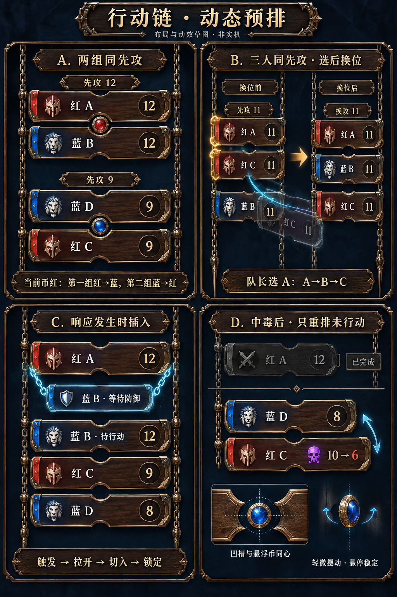

# 行动链动态预排与草图 · 2026-09-29

状态：用户新要求已记录，草图已生成；尚未制作Unity demo或录屏，未修改游戏代码、卡牌描述、核心规则。下一步由用户另行启动demo制作。

图为AI生成的布局与材质概念，非实机。A—D标题、示例先攻组标题、箭头、解释框是设计注释，不自动加入正式游戏。英雄头像为占位，不是本项目定稿资产。板块凹槽、浮币间隙和链节尺寸以运行时几何样板为准。

## 用户已指定的变化

1. 选牌全部完成并公开揭示后，四张牌先按有效先攻排列，并预排同先攻组的队色先后。
2. 两组各两张且各含红蓝一张时，若进入第一组的决策币为红：高先攻组红→蓝，低先攻组蓝→红。
3. 各板上下边中央有向内凹约160度的圆弧。组内板间距更小，两相对凹弧与夹在中间的浮空决策币同心。
4. 三人同先攻可先展示红A、红C、蓝B；队长选红A后，重排为红A、蓝B、红C。另一红板越过蓝板下移，视觉明确。
5. 虎爪中毒改变有效先攻后重新检查后续次序，不让此前已完成的牌再次执行。这应成为可复用机制，而非仅服务虎爪。
6. 整个模块持续轻微左右摆动，玩家可轻微交互。保留此前双链、垂直落板和动态插入响应要求，不大幅倾斜。

“两组各两张”是四席的分组情况之一，布局仍支持三张同值加一张不同值，以及四张同值。更多席位仅为UI扩展考虑，现有联机仍四席。

## 规则复核与边界

已检查 Runtime/Rules/TurnRules.cs 的 AdvanceInitiative：从 PlayedUnresolved 中重新取有效先攻最高者；有效先攻使用 PassiveRules.Initiative。PoisonRules.cs 将中毒英雄的先攻被动从正加成反为负值，非直接降低牌面固定数字；无先攻被动的目标不因此改变先攻。完成行动后的牌已标记 PlayedResolved，不会重入候选。

所以无需为UI修改淬毒匕首/剧毒飞镖描述。需要补的是可复用的只读预排结果与动画；本次为源码检查，不宣称新增的预排实现或战斗中重排测试已完成。

预排必须采用“当前条件下预计顺序”，不是永久锁定整个回合。若把两组顺序永久固定，会与中毒后的动态先攻及现有逐次决策币规则冲突。建议保留玩法，以来源权威的动态预排满足视觉需求。

实际跨队冲突才翻真实币，同队内部选择不翻币。现有核心在确定优先队伍时翻币，可能早于队长提交具体人选；UI不能为配合换位动画把核心翻币推迟或再翻一次。

## 预排与组币

- 按已知有效先攻分组，纯只读地预测后续跨队冲突消耗；只在预测模型中切换币色，不发命令、不改真实状态、不生成决策币事件。
- 两个红蓝混合双人组之间依次继承预测币色。若某组只有同队两人，不消耗决策币，不能机械按“第几组”轮换红蓝。
- 队长尚未确定具体人选时，同队候选临时稳定排列并保持可选标记；队色优先可以预排，不能伪造队长选择。
- 每组悬浮币是同一个全局决策机制的局部显示，不是新增资源。未来组币用弱外环/刻纹区分预测状态；当前组使用清晰锁定/高亮状态。悬停可显示“本组预计红方优先”等简短解释。
- 真实中央币仍为权威状态演出的主位置。组币不各自触发多次中心聚焦，不调用核心翻币逻辑。
- 已开始的主行动、正在解决的响应及已完成历史固定。发生中毒等变化时只重算未行动队列，必要时重组同值组、移位组币或收起已无冲突的币。
- 恢复连接或第一次读取时可能已进入行动/队长选择，币已经翻过；以当前行动和Pending候选为已定前缀，只预测剩余部分，不能拿翻过的币重新裁定本次赢家。建议由核心/应用层提供统一投影，禁止UI根据表面牌序重复演算。

## 凹槽、浮币与多人组

板块双侧链扣保持承重；中央凹槽仅作装饰开口，不切断侧链。上下凹弧使用同半径，币面略小于形成的圆形空间，保留可见背景与细小间隙，明确是浮空币而不是铆死的圆徽章。头像和图标在左、先攻在右、名称错开凹槽上下安全区。模型币可以很轻地转动/浮动，但不能改变它表达的红蓝结果。

同先攻三/四张不压成二列。保持一列和组级外链，根据当前冲突位置显示币；避免每两板之间都出现一枚像独立随机资源的币。同队候选先明确选谁，提交后选中板前浮锁定，其他板按预测队色让位。图B专门显示红C越过蓝B的动作。

异先攻组间距明显大于同值组内间距。无并列时凹槽仍存在，但不生成币。响应子板保留内侧支链和缩进，不使用先攻组币，防止被误认主行动排序成员。

## 中毒后的更新例

某未行动英雄牌面先攻8、被动+2，原有效值10；中毒后被动−2，成为6。另一未行动英雄有效值8应移到他前面。此前已行动者仍停在完成区；当前正在执行的攻击/防御不会因这一变化被中断或重演。

图D的10→6是这一种数值例，不表示所有中毒统一−4。没有改变相对位置时只更新数值和状态，不播放多余换位。若制造/解除同先攻，组币和间距随之重组。

建议把模块命名为“剩余行动预排”，接口接受权威节点及有效先攻变更，不识别具体虎爪卡ID；未来加速、减速、移除待行动牌等都可复用。明确已完成/当前/待行动，而不是简单地重新排序全部四条UI。

## 轻微摆动及交互建议

- 待机：整组约1—3像素左右摆动，周期4—7秒，板角度约0—0.4度，双链左右一致，局部有轻微滞后；不让文字独立抖动。
- 悬停：约0.15—0.25秒阻尼收稳，金属边随鼠标产生小幅高光变化，板轻微前浮，移开后逐渐恢复摆动。
- 交互：装饰链可有轻触拨动的视觉反馈；如果实现拉动，限制在很小偏移后回弹，绝不赋予拖动改变规则顺序的能力。
- 选目标/确认时点击区域保持稳定，不跟随装饰摇摆漂移；局部动画不抢地图合法目标优先级。触屏没有hover时，首次触摸/选中亦可使对应板稳定。
- 插入/换序沿用上一版具有明显张力的解扣、前浮、让位、落锁；轻微待机不削弱关键动作的强弱对比。强动作期间暂停待机，落定后逐渐恢复。
- 可选减少动态设置：停待机、保留短位移与状态更新；不改变行动节奏。

## 后续demo建议验收脚本（本次不执行）

1. 四板从顶端垂落；展示两个混合双人同先攻组，红蓝/蓝红预排及同心浮币。
2. 三张同先攻，队长选择红A，红C向前抽出并移动到蓝B之后；四张同值也能布局。
3. 正常行动中触发防御/弃牌才插入支板；原响应者主行动仍在队列。
4. 中毒导致一名未行动者10→6，越过先攻8者下移，已完成项不动；组币和组距更新。
5. 展示微摆、悬停收稳、轻触反馈；高强度动画不造成板块大幅倾斜。
6. 连续实录、不用跳切掩盖布局问题。独立演示若使用脚本驱动数据，视频明确标注“UI demo”；之后另做真实核心事件接线验收。

目前只保存草图和设计文本，不安装Blender、不修改运行时、不制作视频；高品质链节/木纹/法线资产仍需后续样板制作。
