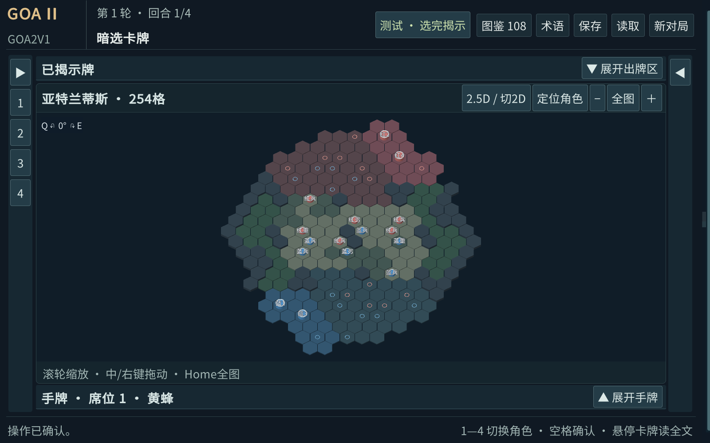
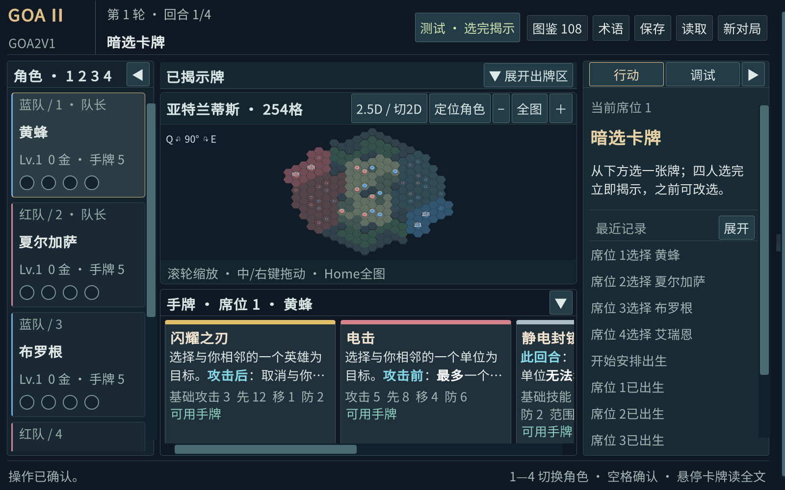
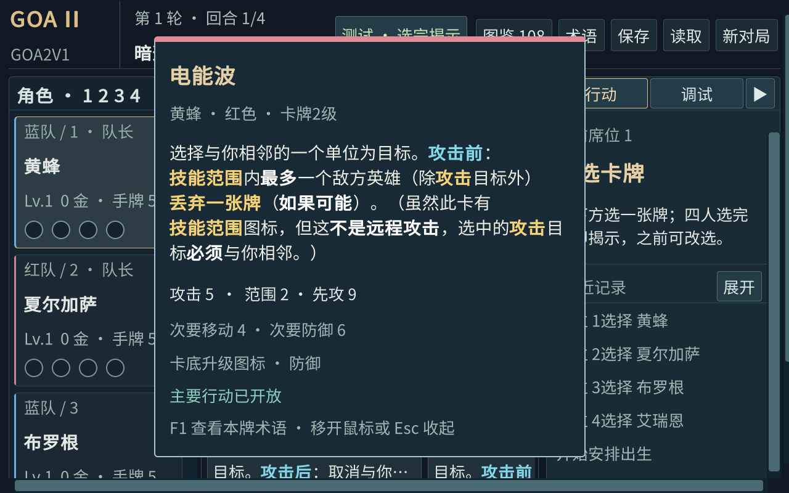
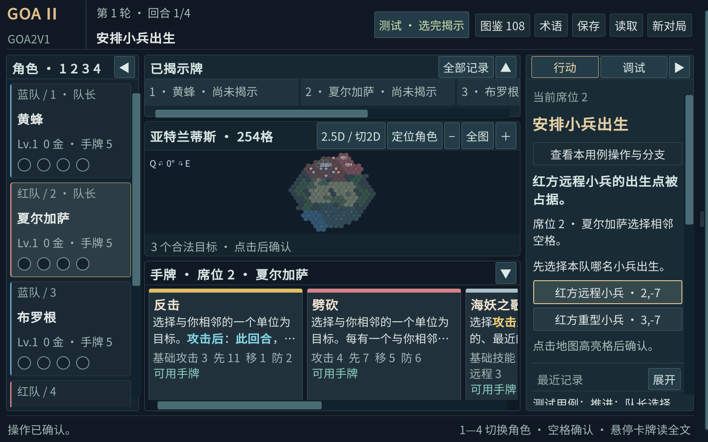

# 阶段 1：可运行 2.5D 棋盘

日期：2026-09-26。实现提交 `774dbb7`，基线 `d0808967b1754a38f858aabab97b9891e99b349a`。
分支 `feature/ui-3d`，工作树 `C:/Users/29383/Documents/StudyFile/personal_project/Goa2V1-ui-3d`。
没有复制主工作区未提交内容，没有切换或修改主工作区，也没有合并或推送。

## 启动

在该工作树 PowerShell 执行：

```powershell
./tools/ui3d/play.ps1
# 直接从原 2D 界面启动：
./tools/ui3d/play.ps1 -Fallback2D
# 如需重新构建：
./tools/build-unity.ps1
```

当前程序位于本工作树 `artifacts/player/Goa2V1.exe`，必须连同同目录 Data/Mono 等文件使用。
启动脚本将日志和热座存档限定在 `artifacts/ui3d/player`，不使用主工作区的存档文件。
也可在 Unity 6000.3.23f1 打开本工作树 unity，执行 Goa2/Prepare project，再从现有 Main 场景 Play。
无新增静态场景资产：棋盘网格、圆柱、材料和专用相机在运行时生成并释放。

Q 左转、E 右转，每次 30°，十二档闭环；滚轮缩放，中/右键拖动，Home 全图。
地图上方按钮可切回 2D。数字 1—4 仍仅是本地热座；本程序不包含联网入口。
收起揭示区/手牌可扩大棋盘；定位角色用于查看靠近地图边缘的英雄。

## 验证结果（分开计量）

| 类型 | 结果与边界 |
|---|---|
| EditMode | 17/17：7 项新几何/旋转用例、10 项现有牌文格式用例；254 格映射往返、邻距、12 档、网格朝向。见 evidence/editmode.xml。 |
| Editor 图形与合成调用 | 1600×1000、1280×800 各通过 6131 个断言，其中 6096 个是 254格×12角度的拾取/全图边界检查；这是几何断言计数，不是 6131 个独立功能测试。见 evidence/editor-1600.json、editor-1280.json。 |
| UI 场景 | 真实 UIDocument/RenderTexture 上检查全部棋子重建、圆柱顶部合法选择、缩放、面板折叠、最长牌文全文及窗口边界、出生/复活/升级/行动页和 2D 回退。没有遍历所有牌效窗口。 |
| 断线显示模拟 | 新棋盘离线时拒绝选择、保留棋子；快照重建释放旧资源。只验证渲染边界，没有网络连接或服务重启验收。 |
| 独立 Player / OS 输入 | Windows Player 实际启动；向已核对路径且处于前台的窗口注入键鼠，20 项通过：Q/E、12档、滚轮、中键拖动、回退以及操作不改变 revision。见 evidence/os-input.json。 |
| 人工手动键鼠 | 未验收。OS 注入经过实际窗口输入路径，但不称为人手操作。没有用截图或合成调用替代这一项。 |
| 截图检查 | 已查看全图、初始局面、旋转、1280长牌文、出生选择画面，修正普通格误画出生圈和远景文字拥挤。下方提供截图。 |
| Windows 构建 | Succeeded，0 errors、4 warnings，109056151 bytes。3 个既有规则/旧 UI 警告，1 个 QA 脚本 nullable 警告。见 evidence/build.json。 |

构建 EXE SHA-256：`82efd5a8c297a5046f6bb72c240dab8972e64003851935eba0a46ad121ce0305`（只标识启动 EXE，不代表整个发行目录的哈希）。
没有更改规则源，未重复完整核心回归；本次只报告上表实际执行范围。

复跑：

```powershell
./tools/test-unity.ps1 -Assemblies 'Goa2.UI3D.Tests;Goa2.Presentation.Tests' -ReportName ui3d-final
./tools/ui3d/audit.ps1 -Width 1600 -Height 1000
./tools/ui3d/audit.ps1 -Width 1280 -Height 800
./tools/ui3d/play.ps1 -Qa
./tools/ui3d/check-input.ps1
```

完整原始输出均在本工作树 artifacts：最终 Editor 目录为 `ui3d/audit-1600x1000-20260926-143353` 与 `ui3d/audit-1280x800-20260926-143200`。
首次编译及中间失败日志保留：缺失 HexRadius/命名空间冲突、测试停留在升级页、初始缩放导致测试目标不在视口的问题分别修正后重跑。
初次非 batch Editor 启动停滞，仅终止核对属于本 worktree 的该进程，后续使用有图形的 batch Editor；未变更系统安全策略。

## 整合清单

1. 由主任务合并本分支，不自动整合。唯一旧文件改动是 GameScreen.Layout.cs 的 9 行新增/4 行删除；逐处审查类型、默认揭示区折叠、Q/E、回退按钮与构造器，不覆盖其他任务改动。
2. 新资源在 Scripts/UI3D 与 Assets/UI3D；前者继承原 Presentation 程序集，以专属 partial 文件承接 QA，不改现有 GameScreen.cs。不要只复制 Layout 补丁而漏掉 shader、meta 或专属脚本。
3. 统一采用联网任务的 IPlayerSession / PlayerIntent 接口提案。接线时由主界面将本人 GameView 与合法格交给 BattlefieldSurface；该控件不持有 GameSession，也没有自行定义 Wire 或命令。
4. 网络适配器负责 revision/身份/线程派发；连接变化先清除主界面预选并禁用全部提交。断线调用 SetConnected(false)；重连用最新本人投影重建，再启用。SetConnected 只禁用地图选择，不代替操作面板的统一禁用。
5. 原 GameScreen 仍是本地热座，不可直接声称整个界面已具备联网隐私隔离。网络模式必须封住 SwitchSeat、Debug、全信息存档入口；四个 Unity 客户端与断线续连留待主/联网任务统一验收。
6. TODO-001 没有实施。BeginPrimary、出牌、确认及结算时机完全沿用原流程；无撤销已结算行动功能。
7. 旧 QA layout 的 Zoom/Focus 仍代表 2D；3D 输入验收读取显式 QA 入口生成的 render.board3d.json，避免把旧字段误当新相机证据。

## 已知显示限制

当前是简单模型原型。全图缩小时文字较小，小兵标签会隐藏；缩放、定位和面板折叠用于阅读。1280×800 沿用原界面的外层滚动，未宣称所有面板同时完整可见。
点击圆柱顶面会选择其所在格；其余区域使用数学格面拾取。低高度和窄半径给格边留出空间，但尚未做人手密集误点率测试。
动画尚未加入，画面直接重建，因此不依赖动画完成；真实网络断线期间的整个界面行为仍待统一会话接线。








