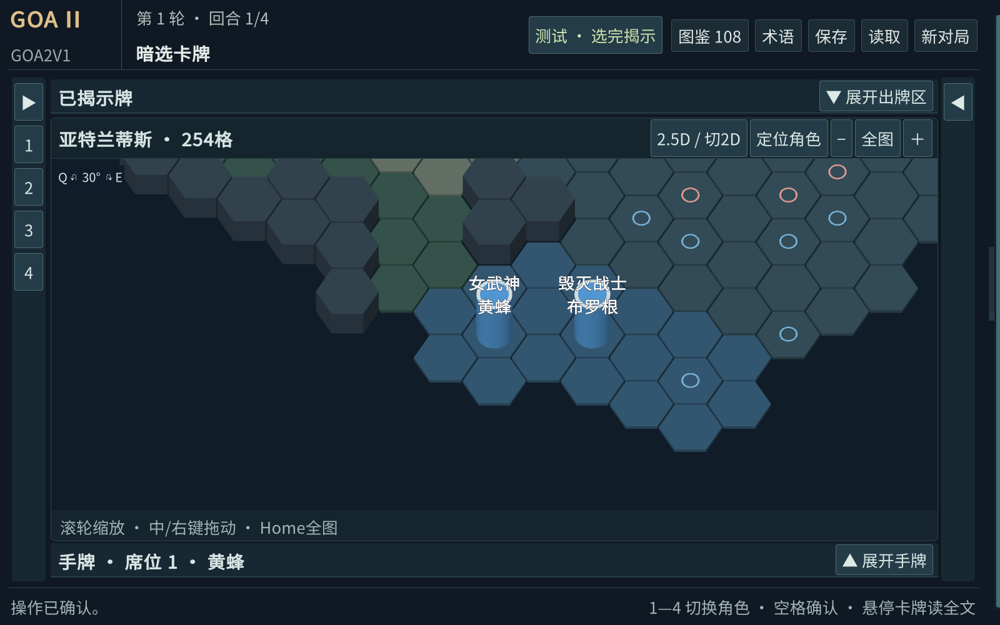
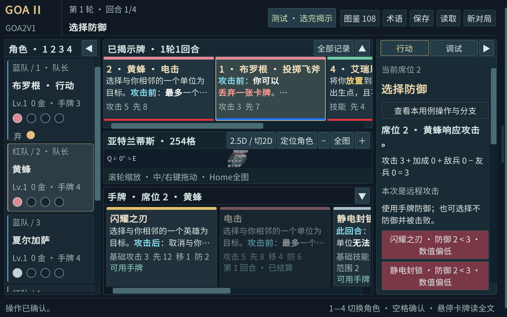

# 2026-09-27 体验修改与待合并交接

实现提交 `ec2953c`，分支 feature/ui-3d；此前以 `0670748` 在本隔离工作树吸收日常开发分支的已提交 `acb0b95`（engine78）。没有复制其未提交卡牌文件。相对 acb0b95，core 与 content 无差异。

用户要求做完合入主分支；已发现 `main` 在冻结基线而日常主工作区在 experiment/ai-level-20260920。用户要求提供 prompt 向主要负责 AI 确认目标/执行方。本阶段实现与验证完成，合并尚待交接答复，没有修改主工作区、合并目标分支或推送。

## 本次行为

- Q/E 仍为 12 个 30°目标档位，使用约 0.24 秒 smoothstep 过渡；连按从当前角度继续，累计目标档数，不瞬跳。相机时间独立于规则，不阻塞提交与画面重建。
- 小兵顶部为“近”“远”“重”；英雄显示正式英雄名，称号和姓名分两行，取消红蓝文字及编号。队伍仍通过原模型颜色区分。
- 墙体网格高度由 0.35 改为 1.05，英雄圆柱高度 2.10；均为显示尺寸，不参与规则。墙底对齐格面。
- 为缓解加高后的遮挡，合法/选中格描边最后绘制，不被模型遮掉；非目标棋子覆盖合法地格时，选择回调可使用该地格。仍不自行计算合法性。两者同为合法目标时，点击顶部优先该棋子，可以点击格边或旋转视角选择后方格。
- “丢弃一张卡牌”等完整数量短语改红，普通移动数量仍保持原强调；源文本保持不变。
- 右侧防御选项在最终有限防御数值小于比较攻击值时显示偏红粉底和“数值偏低”。不据牌效 Successful/Blocked 判断警告，不禁用选项，也不改结算。显示为 ∞ 的防御不作有限数值不足警告。
- 所有使用统一卡面数值组件的手牌、揭示区、升级候选、阅读浮层、详情、图鉴及记录：技能零值不显示 0；防御感叹号显示 ∞。其他攻击/移动零值及非防御感叹号保持原样。canonical、核心 Exclamation 和数值均未修改。

## 验证

| 项目 | 结果 |
|---|---|
| Unity EditMode | 30/30；新增连续旋转/中间帧、模型比例、技能零值、∞、纯数值警告和弃牌红字测试 |
| 实际 Editor 图形与合成操作 | 1600×1000 与 1280×800 均通过，分别 6264 条断言；包含 12角×254格坐标检查、全部108牌统一数值、实际防御流程警告底色、完整英雄名和中间相机角度。断言数不等于独立功能测试数 |
| 卡牌整合场景 | siren-song-two-targets、magic-water-vacated-minion-spawn、covering-fire-decline、energy-explosion-pay、counterattack-defense 五场景通过；覆盖与最新已提交卡牌的原界面共存，不代表联网验收 |
| Windows 构建 | 成功，0 errors、3 个既有 warnings；同一套 engine78 核心和正式内容 |
| 独立 Player OS 输入 | 20 项通过，Q/E、12档、滚轮、中键拖动和回退均不改变 revision；不是人工手动验收 |
| 首次输入失败 | 第一次启动后过早注入 Q 未通过，保留 os-input-first-failure.json；等待新进程生成新 telemetry 并稳定后重测通过，输入脚本已增加就绪门槛 |

证据在 `docs/ui3d/evidence/revision2`。完整图形报告仍保留在本工作树 `artifacts/ui3d/audit-1600x1000-20260927-114328` 和 `audit-1280x800-20260927-114223`，提交的 graphics-summary.json 包含各报告 SHA-256。
启动沿用 `./tools/ui3d/play.ps1`，2D 回退加 `-Fallback2D`。本工作树 `artifacts/player` 已更新。永久 engine34 回退分支和标签不动。

## 给主任务的整合提示

本次增加 CardDisplay 统一格式化类，旧 UI 文件仅做小范围接线：CardTextMarkup、GameScreen.cs、GameScreen.CardReading、GameScreen.Readability、GameScreen.Combat。原第一阶段另有 GameScreen.Layout 补丁。合并时不要覆盖主任务新增的 Combat 分支提示；检查这些交叉文件，再用合并后的同一核心整体构建。
本分支已包含第一阶段两次提交和 engine78 已提交更新；若选择 cherry-pick，不要只取 ec2953c 而漏掉第一阶段 UI3D 资源及类型。若选择完整 merge，先确认目标分支与主工作区提交时间，避免与卡牌任务并发。
联网接口仍遵循已提交提案；这次不引入新网络协议，不改变身份、存档或行动确认时间。整个 GameScreen 的联网适配仍待主/联网任务统一接线。

