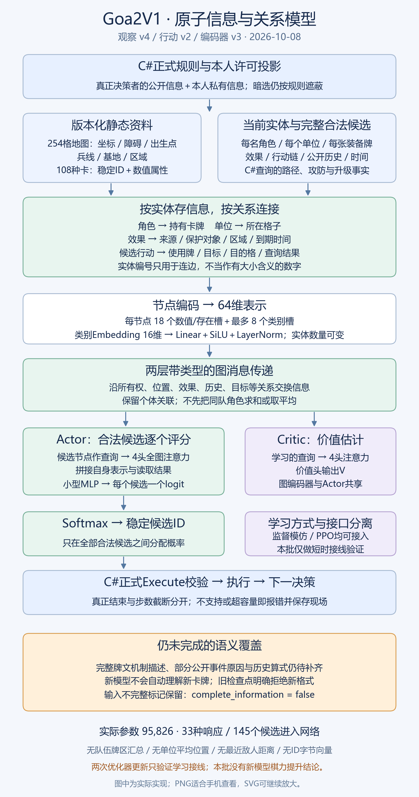

# AI阶段对照：手机查看

本页使用仓库内图片与视频，手机浏览器可打开图片放大；不依赖电脑的C盘路径。10月8日已重构输入和模型；下方游戏录像仍是10月7日旧模型的真实教学对照。

## 当前：10月8日原子输入与关系模型

[新版流程图PNG](ai-entities-20261008/validation/diagram/entity-model.png) · [可放大SVG](ai-entities-20261008/validation/diagram/entity-model.svg) · [九项逐条答复与完整设计](../development/AI原子观察与关系模型重构-2026-10-08.md) · [本批验收](AI原子输入重构验收-2026-10-08.md)

[131个类型化字段的中文含义CSV](ai-entities-20261008/validation/input-fields.csv) · [完整类别/关系/槽位字典](ai-entities-20261008/validation/input-dictionary.json)

逐角色资源、每个英雄/小兵的精确位置、本人及他人牌区、紫卡、持续效果、公开行动链与时间化历史均已进入新网络。完整牌文机制描述与部分公开事件原因仍未全编码，信息完整性仍为false。本批只做了两次优化器更新验证，没有新模型棋力提升或正式胜率结论。

## 10月7日旧版向量模型（历史）

[模型流程图 PNG](ai-observation-audit-20261007/current-model.png) · [可放大矢量图 SVG](ai-observation-audit-20261007/current-model.svg) · [输入完整性核对](../development/AI可见信息完整性与模型架构-2026-10-07.md)

[为何选择MLP、GAN等候选与逐项输入详解](../development/AI模型选型与逐项输入字典-2026-10-07.md) · [全部2047项输入字典](ai-feature-dictionary-20261007/features.csv)

旧版编码器没有读取持续效果、紫卡身份和公开历史等重要信息。以下旧模型合法对局与防御教学改善不证明这些信息已被理解；旧检查点不能加载新版观察。

## 防御微调前

虎爪选择防御3的偷袭，未挡住攻击5，被击败。

[打开微调前17秒录像](ai-stage4-20261007/defense-video/parent.mp4)

## 防御微调后

同一个公开观察和同一组合法候选，模型选择躲闪，抵挡并存活。

[打开微调后17秒录像](ai-stage4-20261007/defense-video/defense.mp4)

录像无声、约2.6帧/秒真实窗口采集，保存为20fps视频；重复帧没有生成新游戏画面。模型先选出响应，再交给现有Unity重放，未接Unity实时推理。只说明这一防御选择改善，不能证明整局已会玩。

[详细防御验收](AI防御微调验收-2026-10-07.md) · [训练方法与模型原理](../development/AI训练方法与模型原理-2026-10-07.md) · [选牌走位短试](../development/AI选牌走位短试-2026-10-07.md)
