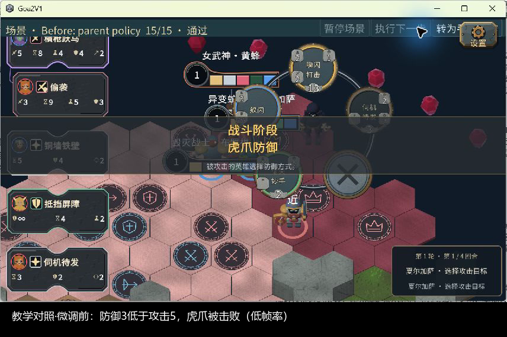
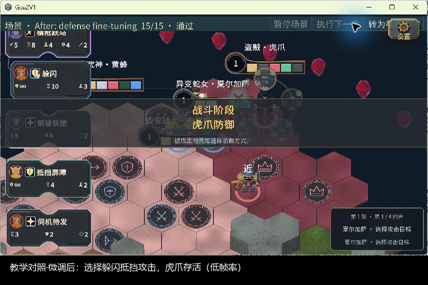

# AI阶段对照：手机查看

本页使用仓库内图片与视频，手机浏览器可打开图片放大；不依赖电脑的C盘路径。以下是同一真实教学局面的Unity截图，不是新一轮走位实验的画面。

## 防御微调前

虎爪选择防御3的偷袭，未挡住攻击5，被击败。

[打开微调前17秒录像](ai-stage4-20261007/defense-video/parent.mp4)

## 防御微调后

同一个公开观察和同一组合法候选，模型选择躲闪，抵挡并存活。

[打开微调后17秒录像](ai-stage4-20261007/defense-video/defense.mp4)

录像无声、约2.6帧/秒真实窗口采集，保存为20fps视频；重复帧没有生成新游戏画面。模型先选出响应，再交给现有Unity重放，未接Unity实时推理。只说明这一防御选择改善，不能证明整局已会玩。

[详细防御验收](AI防御微调验收-2026-10-07.md) · [训练方法与模型原理](../development/AI训练方法与模型原理-2026-10-07.md) · [选牌走位短试](../development/AI选牌走位短试-2026-10-07.md)
