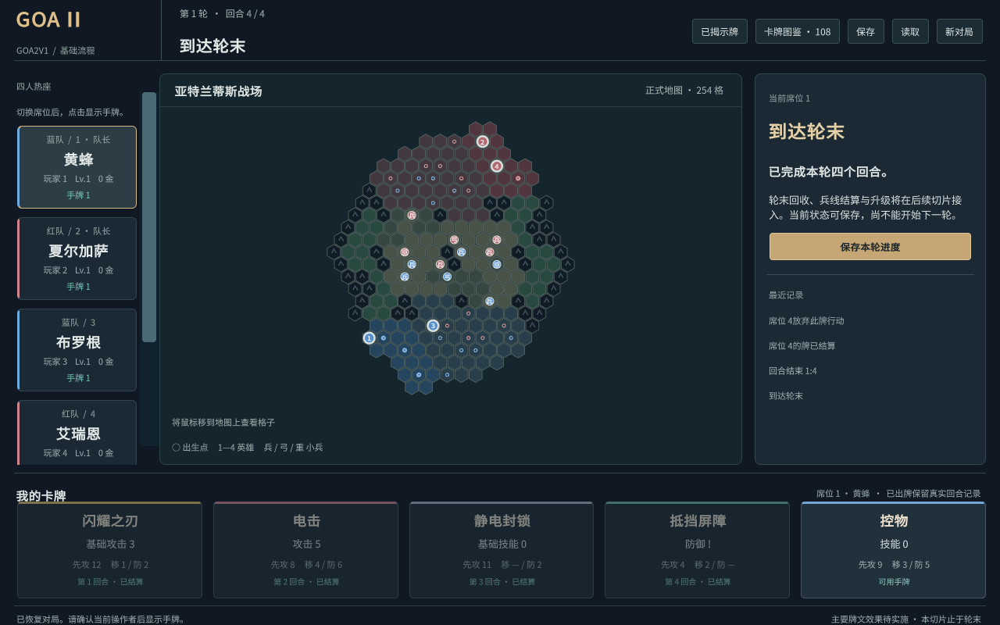
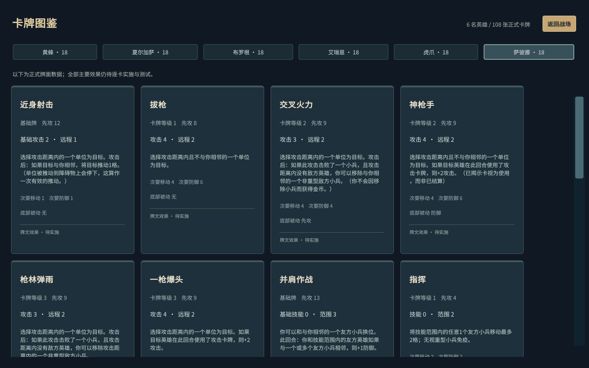

# BATCH-01 验收报告

2026-09-10：[本批范围](../planning/BATCH-01.md)验收通过。这是环境与四席热座基础流程，不是完整游戏发布。

## 安装与构建

Unity Hub 3.21.1.65535官方MSIX哈希通过，用户已登录。Unity 6000.3.23f1（09d2ecc7fb28）安装包4125667560字节，Authenticode Valid、Unity Technologies SF签名，MD5与官方API一致。curl地域跳转404后，PowerShell下载同一官方URL成功。

用户授权手动安装后，以普通权限安装至用户目录 UnityEditors/6000.3.23f1/Editor/Unity.exe，并注册到Hub。实际batchmode编译、集成验证及Player构建通过，证明许可可用。安装器仅列出远程Profiler防火墙规则未配置；本批Release Player不依赖它，未更改防火墙。

.NET SDK固定10.0.401，核心netstandard2.1、C# 9.0；Unity不使用.NET 10运行游戏。中文使用内置Noto字体，许可与来源见[第三方资源](../development/第三方资源.md)。

## 验证结果

| 门槛 | 实际结果 |
|---|---|
| 核心NUnit | Release 31/31通过，0跳过 |
| 资料工具回归 | 11/11通过；结构/引用/内容和来源哈希校验PASS |
| Unity集成 | 6英雄108牌254格，12初始小兵，保存与重放一致 |
| Player | Windows x64 Mono Release，0构建错误、0构建警告 |
| 运行时 | 实际操作期间日志无异常、错误、警告匹配 |
| GUI四回合 | 第1轮第4回合RoundEnd，revision 59，16张已结算牌、4张余牌 |
| 窗口 | 1600×1000及1280×800；中文、地图、侧栏滚动、手牌和图鉴检查通过 |

测试先证实缺失再实施：基础2项失败、导入/流程7项失败、移动4项失败、恢复2项失败，随后转绿。最终覆盖身份/revision、幂等、非法命令原子性、私有投影、内容引用隔离、哈希、防篡改重放、出生、动态先攻、普通路径、快移区域、真实四回合与无手牌跳过。测试映射见[矩阵](../../tests/测试矩阵.md)。

## 实际操作

1. 英雄预选后取消，保存revision仍为0；确认四英雄后revision为4且生成12小兵。
2. 蓝队长安排席位1、3，红队长安排2、4，高亮来自核心合法集合。四人出生完成revision为8。
3. 暗选、改选、确认；切换席位遮挡手牌，最后确认自动翻牌；公开出牌可查看全文与实际回合。
4. 黄蜂次要移动取消后revision仍为18；确认后由(-8,7)到(-9,7)。布罗根快移到(-4,6)，只执行基础移动。
5. 跨队冲突翻币，随后红队同先攻由红队长选择席位2或4。在revision 20的pending保存、读取、再保存，SHA256相同；确认席位4后继续。
6. 通过真实鼠标操作完成余下暗选和放弃，达到四回合轮末；16张牌保留各自出牌回合。
7. 读取轮末存档，在1280×800查看手牌、公开牌和六个英雄图鉴，滚动到萨彼娜第18张。工具只向前台Player发送鼠标，没有直接注入规则状态。

结构化结果见[BATCH-01结果](BATCH-01结果.json)。详细本机日志、TRX、截图、pending和轮末QA存档位于被Git忽略的 artifacts/tests、artifacts/unity；Player位于 artifacts/player。重跑方法见[启动指南](../development/启动与操作指南.md)。Git提交与标签以git log为准，避免报告自引用；没有远程仓库或推送，远程CI未执行。

## 复核与边界

独立一轮对照R-ROUND、R-INITIATIVE、R-ACTIONS、R-MOVE与权限要求。确认主移动牌无次要移动选项、快移不执行原牌文、不能重复重置移动预算、无手牌自动跳过、非法命令不发布部分状态、保存由已接受命令重放核验。

正式内容及108张data_only状态未改。普通主要移动/牌文、攻击/防御、击败/复活、持续效果、轮末/兵线、升级/胜负与联网未完成。先攻和移动接收数值加成并有重算测试，但加成产生/叠加/到期尚未接入。空手测试使用构造的规则局面，UI尚无弃牌效果自然制造它。

本地存档包含全部手牌，不能作为未来公共网络消息。损坏、版本或内容不匹配明确拒绝，尚无跨版本迁移。所有来源档案保持原状；旧版135项通过不能作为新版卡牌证据。
