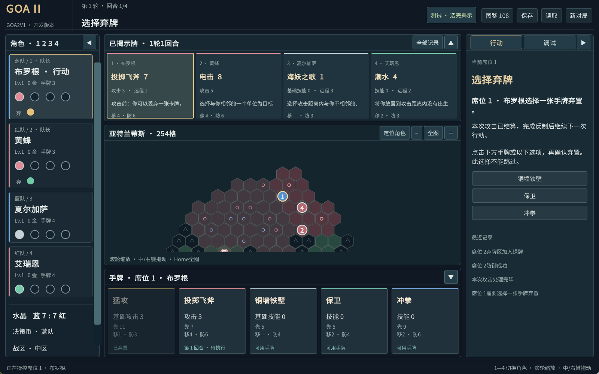
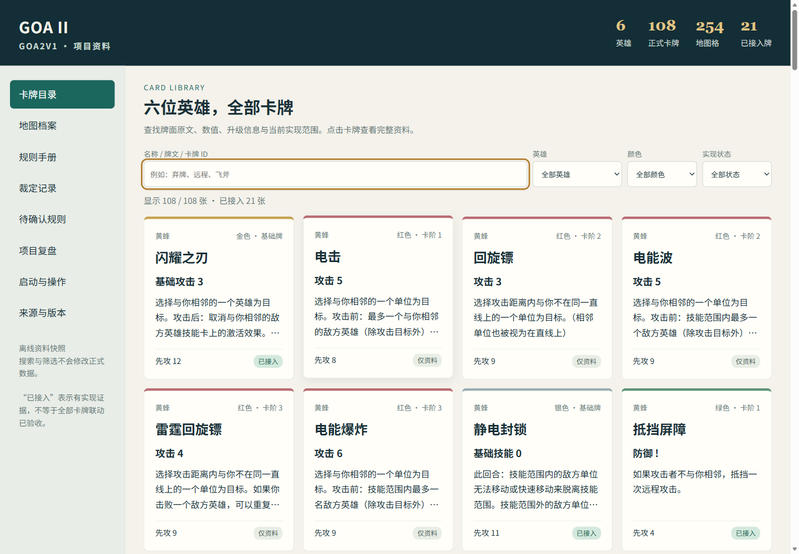

# BATCH-02 本地开发验收

2026-09-10。范围为用户要求的界面、四席操控、手工调试、可选可视化测试，以及后续对局开发与设计。当前引擎8；本报告以实际文件、进程和操作结果为依据。逐阶段过程和失败记录见[BATCH-02工作记录](BATCH-02工作记录.md)。

## 本次要求逐项结果

| 要求 | 结果与实际行为 |
|---|---|
| 不使用交接屏幕 | 完成；点击角色或1/2/3/4立即切换，文字输入和对话框阻止背后误切换 |
| 四边栏及字体扩大 | 完成；四周内容加大，最小窗口保留滚动；窄手牌名称与数值分行，支持全文提示 |
| 中央地图滚轮缩放 | 完成；鼠标锚点缩放、中/右键拖动、Home全图与定位角色，切换角色保留地图视口 |
| 左侧四回合圆点与弃牌区 | 完成；四个空心槽按回合填出牌颜色；弃牌仅按实际数量另行显示，取回后移除对应点 |
| 顶部维持已揭示牌 | 完成；下一次揭示才更新，下一轮暗选仍保留最近公开牌；另外可查看历史 |
| 上下左右展开/收起 | 完成；各侧保留按钮，收起释放地图空间，规则刷新保持折叠状态 |
| 手工调试接口 | 完成；金币、快选、自动准备、同色配牌、弃回牌、传送、击败/移除、水晶、决策币及快进；八个游戏内预设可直接接着操作 |
| 测试可选是否可视化 | 完成；同一JSON场景可无窗口运行或可见播放，支持暂停、单步与转为手工操作；真实鼠标/键盘测试另行记录 |
| 测试四人选完立即揭示 | 完成；默认无需再确认，也可切回逐人确认；保留四人全部确认才揭示的正式流程 |
| 完成后继续内容与设计 | 已推进基础攻防、反制、复活、兵线、升级循环、21张牌、长档恢复、离线资料浏览与后续卡牌/联网设计；完整游戏剩余范围见下文 |

本次列出的界面、调试和测试操作要求没有省略项。完整108牌规则和联网不是本批已经完成的结果。

## 运行与手工检查

双击artifacts/player/Goa2V1.exe，或解压本批Windows程序包后双击其中Goa2V1/Goa2V1.exe。须保留完整程序目录。实际对局不需要启动Editor、服务器或.NET测试宿主。

最短手测路径：调试→自动选英雄与出生→按1—4依次选牌。四人选完立即揭示；调试→打开测试局面可选飞斧准备、攻击前弃牌、反射强制弃牌、长矛已有弃牌、还击、升级、复活、占位出生八种起点。保存并加载预设前先保存当前局，取消保持原局。

推荐1600×1000。1280×800与1152×768均完成整套14模块真实键鼠验收。详细操作见[启动与操作指南](../development/启动与操作指南.md)，测试命令见[自动化测试](../development/自动化测试.md)。

实际1600×1000窗口，停在飞斧遭反射屏障后的本人弃牌窗口；四周全部展开，地图定位当前角色，可继续滚轮缩放。

正常存档位于Windows用户目录AppData/LocalLow/Goa2V1/Goa2V1/saves/hotseat-v1.json，替换保存保留.bak。QA使用artifacts中的独立副本。坏存档或保存失败有可操作说明；只有完整验证、重放和最终状态比较成功才替换当前会话。

## 数据与规则范围

正式数据为6英雄、108牌、254格、44障碍、8种区域标识；148份来源文件、24张现存照片、12份OCR文字和1张Git恢复照片分别保留。规则、裁定、疑问、复盘、数据字典和108份卡牌准备稿已经整理。原英文规则PDF缺失仍登记为U-010，不能声称重新逐页核对了该原件。

正式内容哈希：e91b2db215bf63f527cab03ceb09565bcb9a3f9cb055bd26235330fbb36568b7。

| 已开放主要行为 | 卡牌 |
|---|---|
| 11张攻击 | 闪耀之刃；劈砍、快速突刺、致命横扫、死亡回旋；投掷飞斧、投掷长矛；背刺；拔枪、神枪手、一枪爆头 |
| 8张防御 | 抵挡屏障、偏转屏障、反射屏障；躲闪、近身格挡、近身还击；挑战者；带头冲锋 |
| 2张基础技能 | 静电封锁、打断施法 |

上表名称以正式卡表为准，状态为21张implemented、87张data_only；未提升为全部行为矩阵或全卡集成完成。主要移动、放置、推动、换位、标志物、完整触发/替换队列、紫卡文字和其他牌联动仍待开发。

四身份联网已形成[ADR-005](../architecture/decisions/ADR-005-四身份联网切片.md)和16项[NET-01验收设计](../planning/NET-01验收设计.md)，运行时未实施。后续87张牌已逐一归入14个主要依赖组，见[剩余卡牌开发路线](../planning/剩余卡牌开发路线.md)。U-013/014/015/016尚无回复，仅暂停对应分支。

## 验证证据

不同层的数字分别报告，不把脚本步骤、检查点和规则测试相加冒充独立规则数量。

[结果索引JSON](BATCH-02结果.json)登记原报告路径与SHA-256、29份实际场景输入/结果、两种窗口检查数、长局停止原因和程序包信息；生成时已重新读取原文件核对通过状态、数量和哈希。

| 层级 | 结果 | 证据位置（相对项目根目录） |
|---|---|---|
| Unity同源核心 | 394/394通过 | artifacts/unity/tests/native-presets-all.xml |
| 资料、历史夹具与打包工具 | Python32/32通过；正式资料/哈希/引用通过 | tools/validate.ps1及本批运行输出 |
| 标准窗口真实键鼠 | 14模块238/238；程序文件全程未变 | artifacts/ui-suites/9c7cfe75028f468983e8ad53f45ac38f/suite.json |
| 最小窗口真实键鼠 | 14模块238/238；程序文件全程未变 | artifacts/ui-suites/7b5f1cdef43c41d2acdc4c586852e7ea/suite.json |
| 原生场景 | 29份、442步后台通过；代表攻防另有可见同态重放 | artifacts/scenarios及逐阶段工作记录 |
| 长局生成与场景重放 | 4组2321条命令；Unity长测试加2项短测试6/6通过 | artifacts/simulations/5617f24c65e647518aec2a9eab3f2dcb |
| 优化后长局原生重放 | 4组完整末态与原程序一致 | 上述长局目录/player-replays/fe6b0cae5bdc4d0fb5d96162c48429d3 |
| 700步可见长局 | 与后台最终完整存档哈希一致 | 上述长局目录/player-replays/d22f1e192076462ba173de62b4c28e38 |
| 长档真实操作 | 22/22；8次角色切换、加金、701条存档恢复，原输入不变 | artifacts/long-ui/b40f5260217848ceae3f3bf1adedbfad |
| 可见播放控制 | 12/12；暂停、单步、继续、场景控制隔离、完成后转手工；9步末态与后台一致 | artifacts/playback-ui/92fa26e1750b4585a936618d4c96f7be/controls.json |
| 最新源码独立目录 | 资料32项、Unity394项、构建与20步原生场景均通过 | artifacts/source-checkouts/ab00eed10f3c43e9bfe839d10e6da1b2/checkout.json |
| 离线资料浏览器 | 可见浏览器23/23，零网络请求/脚本错误；无窗口模式亦有独立通过证据 | artifacts/reference-tests/d5ac34267cc84425aa3c9b607a4bb782/report.json |
| 程序资料缺失恢复页 | 独立解压副本7/7；恢复原文件后重新核对全部程序并正常启动 | artifacts/release-content-ui/30e0ed73a9274abda12cd0ec06999b7c/content-ui.json |

最新源码验证取自提交1f31f701a4646b962981caa695a570732753b418，在新目录中没有Library或预生成正式/调试内容；它使用本机已安装Unity及全局包缓存，不等同于在全新电脑安装环境。后续只有测试工具/文档整理，游戏源码以构建输入清单核对。

Unity已安装并正常激活，版本6000.3.23f1；Windows Player为x64 Mono Release。本机.NET测试宿主遇应用控制0x800711C7，未绕过系统限制；Unity运行同一份核心NUnit测试。旧158项.NET通过和旧版135项通过只作为相应历史证据，远程CI未运行。

## 长局与性能的实际边界

| 种子 | 模式 | 接受命令 | 结束位置 | 停止原因 |
|---|---|---|---|---|
| 201 | 正式确认 | 468 | 第9轮，红队获胜 | 自然水晶胜利 |
| 202 | 测试 | 700 | 第18轮 | 步数上限 |
| 203 | 正式确认 | 453 | 第9轮，蓝队获胜 | 自然水晶胜利 |
| 204 | 测试 | 700 | 第18轮 | 步数上限 |

这些是已接入规则的确定性组合测试，不能替代未实现87张牌的行为验收。之前引擎7的8组400步出现NUnit超时，原失败未删除，也没有被后续原生重放结果改写为NUnit通过。

同一838,936字节、700条命令存档，完整程序启动→规则重放→首次界面快照由84.23秒降至5.67秒，低于15秒预算。8次角色切换约508—1033毫秒，加5金约755毫秒，均在1500毫秒交互预算内；包含输入助手固定350毫秒等待，不是纯规则计算耗时。优化保留实时命令原子性及恢复的完整状态比较，详见[ADR-004](../architecture/decisions/ADR-004-隔离重放恢复.md)。

## 本地程序包

文件：artifacts/releases/Goa2V1-e8-final-20260910-131348-72e26372.zip。

- 压缩包47,239,426字节；程序内容156文件、107,762,919字节。
- SHA-256：489dc36c3420ad77e9d9986f5163f028f652ca34e4af96ca047a648ab0c9f5c9。
- 构建清单核对188份输入和全部程序内容；修改、缺件、混入文件或不匹配源码会拒绝打包。
- 独立解压后台20步通过，末态5ff1cd6d364ce7a5821b14f55d824e171df047bd367859db42b16e467cc3412f；证据artifacts/release-smoke/8857d7f0cd014d689390f9047357a5ba。
- 独立解压可见20步通过，末态相同；证据artifacts/release-smoke/91a4fc52355f445b9e137c1c054f2f62。

本包用于本地开发和手工测试，未对外上传。正常存档、Unity安装目录、缓存和账号状态不进入Git或程序包。需要重建或核验包时使用[本地程序打包](../development/本地程序打包.md)中的工具。

本机完整交付目录为artifacts/delivery/Goa2V1-BATCH02-20260910，入口“开始使用.md”。其中源码与资料ZIP来自最终本地提交，Windows ZIP与上面的已验收程序相同，另附离线HTML和选取的原始验收报告。manifest.json登记每份交付文件的长度、SHA-256及原证据路径映射；不包含Unity安装器或项目缓存。源码内仍完整保留规则、裁定、原始照片/OCR、旧版本证据和后续设计。

## 离线资料入口

直接打开artifacts/reference/Goa2V1-资料浏览器.html，不需启动服务。它内嵌完整卡牌与地图、21份合同、规则/裁定/疑问/复盘/操作说明，登记34份输入哈希。当前HTML的SHA-256为ea91049681b35e2ae046b2a3f68d022c690ad37a8cee9800cb579e86c45796e5；再次生成会更新生成时间和文件哈希。

后续按[下一批计划](../planning/下一批开发计划.md)推进。当前本地交付门槛通过；全卡、外网四人完整对局、最终美术/音频/教程与正式发布门槛仍需后续独立验收。
