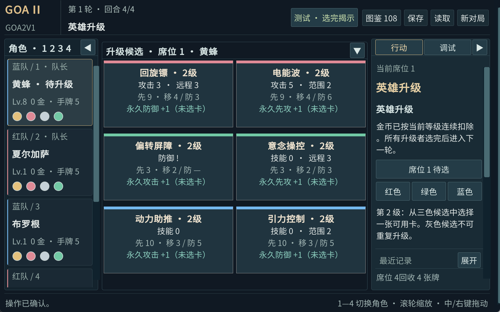
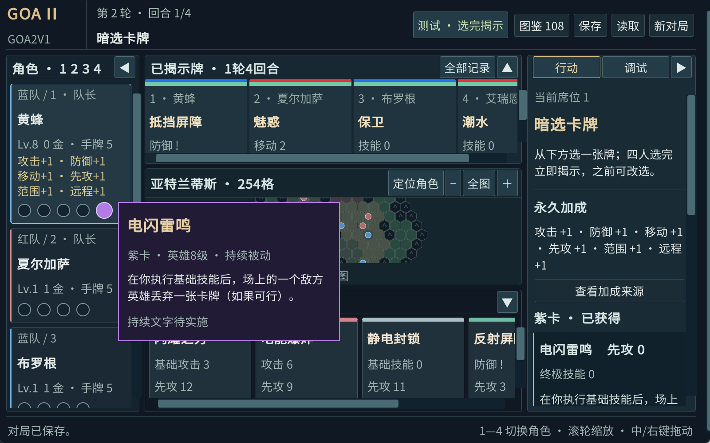
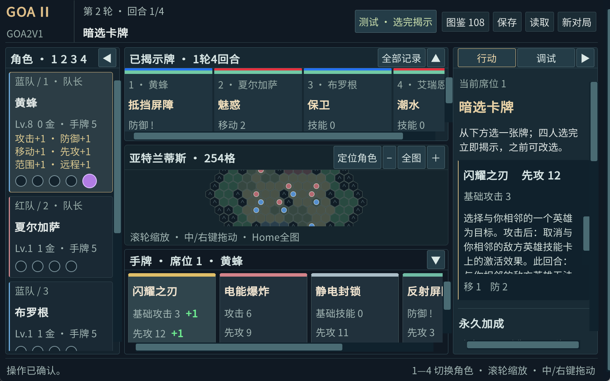
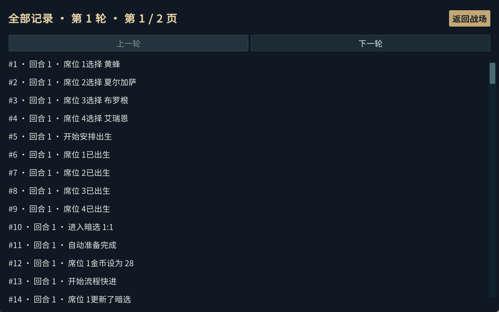

# BATCH-03验收

对应2026-09-11用户十项要求，实现及本批验收已完成。当前引擎9，运行源码提交f37cbd3；以下均为本批实际执行结果，不借用BATCH-02报告充当新测试。

| 要求 | 实现与边界 |
|---|---|
| 选牌被动 | 选中手牌右侧分项绿色+n；保留牌面基础数值，先攻、攻防、移动、范围/远程分别对应。 |
| 测试攻击 | 暗选阶段基础非远程攻击，地图选敌人，忽略距离；小兵保护/奖励与英雄防御/击败/水晶走既有核心，完成后回暗选。 |
| 非卡牌缺口 | 已逐项整理联网、通用事件与位移、极端出生、对局管理、成品体验及发布验证。 |
| 六候选/字号 | 三颜色、每行两张，已升颜色禁用；窗口不足可滚动。界面最小26像素，较原13像素下限翻倍。 |
| 揭示与色条 | 当前有效先攻从高到低，平手保持任意顺序；手牌/揭示牌色条9像素，顶部额外红蓝队伍条6像素。 |
| 8级紫卡 | 引擎9显式选择确认唯一候选；取得后较大常亮紫圈，悬浮显示信息；紫卡文字仍待实现。引擎0—8不更改历史自动授予。 |
| 图鉴 | 金银红绿蓝紫六个横向行，保留英雄/关键词/可用筛选。 |
| 空格 | 执行当前选择的确认，防重复；输入框及覆盖窗口不提交底层选择。 |
| 全部记录 | 最近12条；展开后每轮一页，可滚动看该席有权限看到的全部事件。 |
| 卡牌与测试计划 | 21张已开放牌清单、87张后续路线、手工步骤及自动测试命令已有专文。 |

完整说明：[当前功能与测试说明](../development/当前功能与测试说明.md)。

## 测试结果

| 检查 | 本批结果 |
|---|---|
| Unity同源核心NUnit | 405/405 |
| Python内容、历史夹具与打包保护 | 32/32 |
| 无窗口Player正式场景 | 30份，448步全部通过 |
| 原有真实键鼠界面回归1600×1000 | 14组，238/238；运行期间Player未改变 |
| 本批新增界面1600×1000 | 35/35 |
| 本批新增界面1280×800 | 34/34；仅大窗口额外检查六候选同时可见 |
| 可视化播放控制 | 12/12；暂停、单步、继续、转手工，最终状态与无窗口一致 |
| 离线资料浏览器 | 23/23 |
| Windows包独立解压运行 | 20步通过，156个载荷文件校验通过 |

精确报告路径、SHA256、30份场景逐份输入与最终状态见[BATCH-03结果.json](BATCH-03结果.json)。30份场景的输入及四个核心DLL与最终构建一致；其中部分早于最后一次纯展示层构建，不宣称它们全部使用最终展示DLL。最终完整载荷另经真实界面回归和独立解压测试验证。构建清单的所有源文件及载荷哈希均与当前文件一致。

本机.NET测试宿主受Windows应用控制阻挡；405项由Unity运行同一套纯C#测试。没有代码行覆盖率报告，也未宣称87张未实现牌、联网或全部牌间组合已通过。构建有一处Unity6弃用API警告（键盘事件PreventDefault），没有编译错误；空格防重复及覆盖窗口保护已实际验证。

## 程序与截图

最新Windows程序包：[Goa2V1 Engine9 BATCH03](../../artifacts/releases/Goa2V1-e9-batch03-20260910-190705-63dbd031.zip)。解压后运行Goa2V1.exe；本地已构建入口为artifacts/player/Goa2V1.exe。包SHA256：

`ce41464384ac93d986d5ea72265c8897a3a309160c62aa8bfe990bd41a0e07a0`

普通存档未由自动化测试覆盖。旧存档须在全员未选牌的暗选阶段点“采用当前规则”启用引擎9新流程；未迁移仍保留旧版自动发紫卡语义。

## 修复证据

已保留先失败测试：旧版自动授予紫卡使新增用例0/1失败；新增DebugAttack未实现时0/2失败。第一次全核心396/397，失败是旧轮末场景仍预期自动紫卡；改为真实提交紫卡后全部通过。实际小窗口检查发现过页脚遮挡底行候选，已通过固定最小画布与外层滚动修复；失败报告没有删除。
