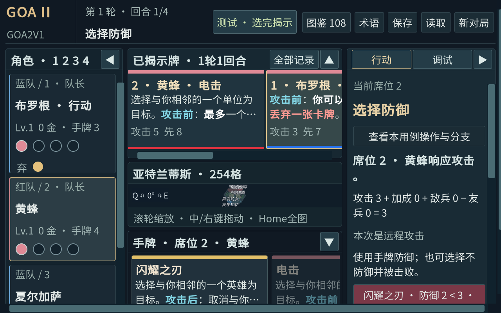

# UI3D 与 engine79 整合验收

目标分支：`experiment/ai-level-20260920`。执行方：主对话。用户于2026-09-27要求确认并协调 UI 合并；主对话完成当前卡牌的收尾后串行整合，期间未开始下一张卡。

先将心灵控制 engine79 单独提交为 `deff8a1`（90/108，18张data_only），再完整合入 UI 指定提交 `03a6b34`，包含 `ec2953c` 和第一阶段 UI3D 代码资源。未只挑选最后一个实现提交，未复制其他工作树未提交文件。UI 与联机工作树未修改。

`GameScreen.Combat.cs` 自动合并后逐项核对，保留 engine79 的 `unit_placement_repeat` 识别/跳过按钮及 UI 防御数值警告。`CardTextMarkup` 改动只作用于显示强调，卡牌描述附加裁定保留。合并相对心灵控制父提交没有 core/content 差异；未把 UI 显示的 ∞ 改写进核心数据或规则。

## 本次实际验证

| 检查 | 结果 |
|---|---|
| 相关 Unity EditMode | 48/48：心灵控制7、意念操控11、展示及UI3D共30 |
| Editor 图形与合成输入 | 1600×1000、1280×800，各6264条断言通过；不等同独立功能数或真实OS输入 |
| 卡牌 Editor 场景 | 7场景116步骤通过：海妖之歌、魔法水流、火力掩护、电能爆炸、反击、心灵控制重复、心灵控制小兵回归 |
| Windows 构建 | 合并源码构建成功，Unity 6000.3.23f1，engine79 |
| 发行包 | 构建输入及包内容校验通过，路径与SHA256见下方 |
| Git 检查 | 无文本冲突、diff check通过；最新卡牌/UI接线同时存在 |
| 永久基线 | main、baseline分支、永久标签指向的提交均仍为51570b78d8b2b1225bbd745a947828c8e6c6e2e4 |

命令均在集成工作区执行：

```powershell
./tools/test-unity.ps1 -Assemblies 'Goa2.Core.Tests;Goa2.Presentation.Tests;Goa2.UI3D.Tests' -Filter 'HeartControlTests;MindControlTests;Goa2.Presentation.Tests;Goa2.UI3D.Tests' -ReportName ui3d-engine79-merge
./tools/build-unity.ps1
./tools/ui3d/audit.ps1 -Width 1600 -Height 1000
./tools/ui3d/audit.ps1 -Width 1280 -Height 800
./tools/run-editor-scenarios.ps1 -Scenario tests/scenarios/siren-song-two-targets.json,tests/scenarios/magic-water-vacated-minion-spawn.json,tests/scenarios/covering-fire-decline.json,tests/scenarios/energy-explosion-pay.json,tests/scenarios/counterattack-defense.json,tests/scenarios/heart-control-repeat.json,tests/scenarios/heart-control-minion.json
./tools/package-player.ps1 -Label e79-ui3d-integrated
```

证据：[summary.json](ui3d-engine79/summary.json)、[EditMode](ui3d-engine79/editmode.xml)、[构建输入清单](ui3d-engine79/build-sources.json)。summary保存图形报告、场景、包及原始输入的哈希和本地路径。

发行包：`artifacts/releases/Goa2V1-e79-ui3d-integrated-20260927-040252-de0b13e9.zip`。

SHA256：`1de1ab8814b156106f335d01f2488db67eac6edbf47ad93639ad408ff36ad8e7`。

启动：`./tools/ui3d/play.ps1`；2D回退：`./tools/ui3d/play.ps1 -Fallback2D`。当前主工作区 `artifacts/player` 为本次整合版本。

## 验收边界与后续

- 本次整合没有重跑独立Player的OS键鼠测试。UI分支记录的20项OS输入通过属于其engine78版本，保留原证据，不改标成engine79新测。人工操作体验也不能由自动报告代替。
- 本次48项相关回归及7个场景不等同全量核心测试；此前engine77的1837项全量证据仍是历史结果。
- 实际查看两张图形截图后发现：1280×800、四栏全展开时，棋盘被压缩至很小高度，单位名字密集重叠。几何/命令检查通过不能说明这种布局体验已达标。记录为UI下一批优先优化建议：保留棋盘最小高度，采用窄屏面板布局或响应式折叠；须遵循用户最新展示偏好，不能用缩小全局字号简单规避。
- 联机分支未合入，`IPlayerSession`与整个GameScreen的接线、四个实际Unity客户端的联网验收仍待执行。将该接线分配给唯一实施者，避免UI与联机各写一套。
- 下张卡牌为移形换步，仅合同已准备。新卡牌会话启动前需明确独占工作树与交接，本主对话不同时另做同一张卡。



## 后续协调

UI任务无需再次向集成分支合并。本次整合提交公布后，UI任务可在自己工作树干净时吸收该提交，再继续下一批。

协作规则和可复制提示词见 [多会话协作与标准提示词](../development/多会话协作与标准提示词-2026-09-27.md)。此文件记录整合与分工，不表示已通过工具联系其他对话。
