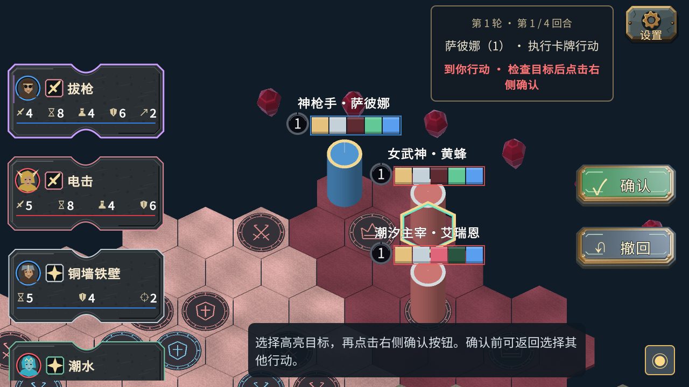
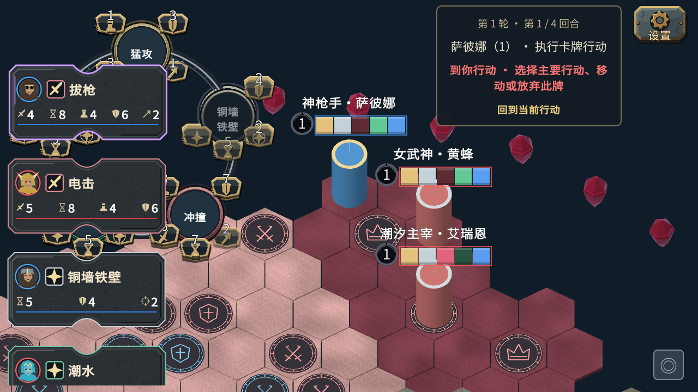
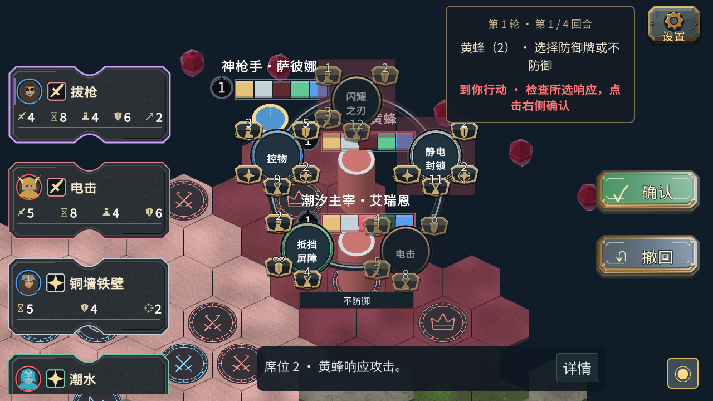

# 主流程与自由观看验收

实现与操作说明：[开发记录](../development/主流程引导与自由观看-2026-10-05.md)。Unity 6000.3.23f1，规则仍为 engine97。

## 证据

- [EditMode](main-flow-20261005/editmode.xml)：50/50，覆盖21种待选类型的操作者判定、暗选公共摘要不泄露、升级/轮末/胜利提示、原有技能环和相机规则。
- Editor 真渲染：[1280×720](main-flow-20261005/editor-1280.json)、[1600×1000](main-flow-20261005/editor-1600.json)，各76项检查通过。
- [独立 Windows Player](main-flow-20261005/player-1600.json)：1600×1000，78项检查通过。使用最终构建运行原规则场景，覆盖多环/自由观看/返回、主要与次要行动预览、右侧确认、攻击/防御/弃牌连锁/复活、队长兵线选择、升级与暗选返回；额外验证延迟提交期间选择和revision变化会取消旧回调。
- [构建报告](main-flow-20261005/build-report.json)：Windows x64成功，0错误，6警告。不是“所有警告清零”。
- 首次1280检查因两个按钮相邻边界没有间距失败；增加6px间距后通过。失败原报告保留在 artifacts/ui3d/audit-1280x720-20261005-153021，不冒充通过报告。

图形检查使用程序调用与合成事件，不是OS鼠标注入或真人验收。未执行四台异地联网验收，未改变原联网包协议和房主规则。全部本批测试客户端结束后自动退出。

## 画面

同日后续复核：早期独立Player使用Hidden窗口，程序布局检查虽通过，但截图为黑图，不能据此宣称Player画面已验证。以下四图已改用同一批旧源码的Editor 1280×720实际渲染图；原黑图仍保留在artifacts原报告目录。新版本使用可见Player重拍，并增加空白截图检查，见[紧凑布局验收](紧凑布局与浮雕按钮-2026-10-05.md)。

## 用户验收待办

- 右上窗口是否足够简明，轮到本人时是否容易注意到。
- 多环重叠时的可读性；目前保留战场空间位置，可通过缩放/平移查看，不会自动避让英雄。
- 石材/黄铜/绿灰按钮的美术、大小及进出速度是否符合期望。这是Blender建模烘焙素材与Unity动画，不代表最终美术验收通过。
- 升级时可先自由看战场，再点击右上窗口恢复候选；已提交效果不可撤回。
- 四台异地真人联机继续留待用户验收。

## 本地交付

- 实现提交 `f1e6e3f`。完整邀请联机包仍包含现有启动器、房主、EasyTier用户态组件及新Unity客户端；未增加系统配置修改。
- 桌面 `Goa2V1/01-开始联机`、`02-开始本地试玩` 已指向 `桌面/解压区/Goa2V1-流程引导-f1e6e3f/Goa2V1-Multiplayer`，独立桌面副本377项文件校验通过。
- 发给好友：`桌面/Goa2V1/发给好友/Goa2V1-流程引导-f1e6e3f.zip`。SHA256：`e0d9a74aec2d784192636da03db4487d8b1eb572571dd042e184ed6c60cff858`。
- 原始发行目录 `artifacts/releases/Goa2V1-Multiplayer-main-flow-20261005-074055-048970`，同名 `.report.json` 留存包校验结果。
- 旧分享ZIP移入 `桌面/Goa2V1/历史版本/20261005更新前`；旧解压目录、邀请凭据、战况、Blender工作副本均保留。桌面03手册已添加本次操作。
- 这次没有启动网络组件或执行新路径防火墙许可流程；新路径首次联网可能仍会弹出Windows允许提示。好友需要换包才会看到新UI。
