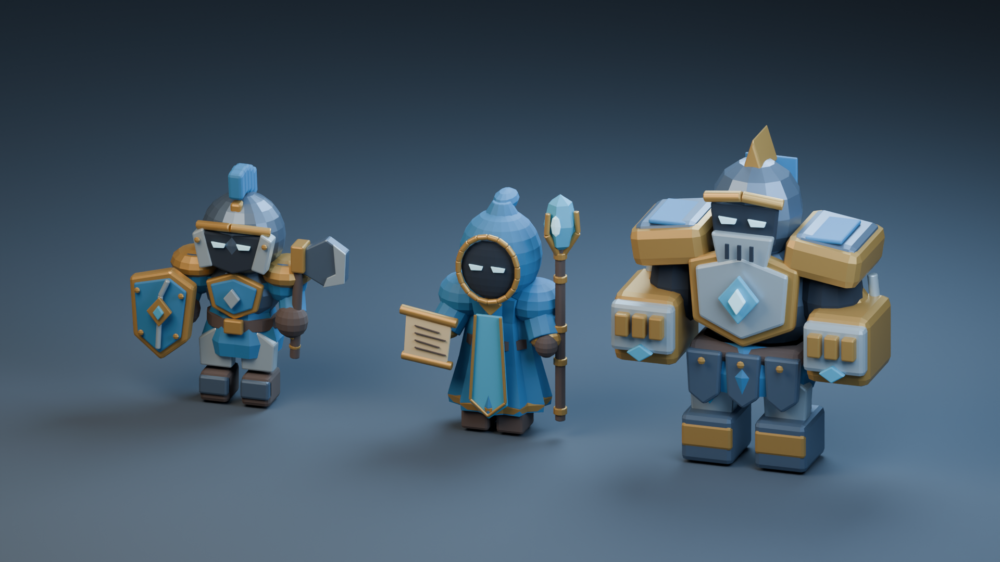
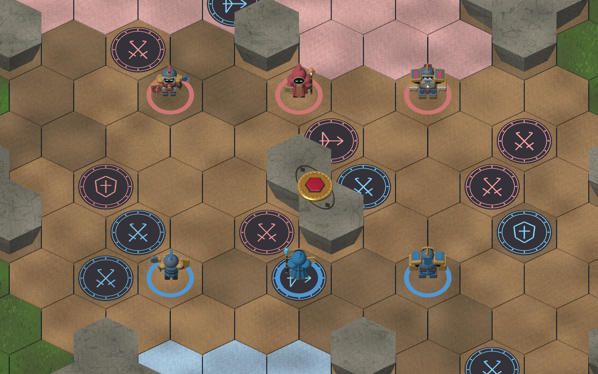

# 小兵模型第一版 · 2026-09-30

## 已实现

在 experiment/ai-level-20260920、1f4c419 基础上完成三个原创模型及 Unity 展示接线。近战与远程参考 LoL 兵种的职业装备、体型与层次；重型参考王者超级兵的装甲体量，材质与另两种保持一致。未提取商业游戏资产。

- 近战：头盔、短斧、盾牌；9460三角面。
- 远程：兜帽、长袍、水晶法杖、卷轴；12548三角面。
- 重型：宽肩、装甲重拳、护胫；8400三角面。
- 共用语义材质槽与18骨骼名称，红蓝替换阵营布料；当前为刚性分件权重。
- 棋盘按兵种归一化尺寸，红蓝相向；地面阵营环、近/远/重标记及原点击格子判定保留。仅替换小兵显示，不改变规则、Command/View、存档或联机身份投影。

可编辑源文件：[Goa2_Minion_Collection.blend](../../art/minions/Goa2_Minion_Collection.blend)。生成与导入说明：[README](../../art/minions/README.md)。源文件保留隐藏的独立分件、运行网格、骨骼和预览场景；再次运行生成器会覆盖该源文件，手工精修前保存副本。

## 预览

Blender 棚拍用于看造型，不代表 Unity 光照：



实际 Unity 棋盘渲染的六模型陈列测试（展示夹具，不是已进行的多人对局）：



## 验证

执行命令（项目根目录）：

```powershell
./tools/test-unity.ps1 -Graphics -Assemblies 'Goa2.UI3D.Tests' -Filter 'Goa2.UI3D.Tests.MinionModelTests;Goa2.UI3D.Tests.Board3DTests' -ReportName 'minion-graphics-20260930'
./tools/test-unity.ps1 -Assemblies 'Goa2.UI3D.Tests' -Filter 'Goa2.UI3D.Tests.MinionModelTests' -ReportName 'minion-import-headless-20260930'
./tools/build-unity.ps1
python tools/player_package.py verify-build artifacts/player --source-root .
```

- 图形模式11/11：三资产的网格、骨骼、材质槽、世界尺寸、无碰撞体；实际棋盘构建/渲染/小兵点击；展示前后规则存档一致；原棋盘几何7项。
- 无图形导入检查3/3。渲染测试标记 RequiresGraphics，默认无图形运行排除它，避免无图形模式进入PlayMode导致Unity崩溃。
- Windows构建成功，0错误、9警告；构建输出114049187字节。
- 源码/构建清单验证PASS：158文件，engine97，Unity6000.3.23f1。
- 已保存测试XML、构建报告、源文件和FBX的SHA256清单。没有重跑卡牌全量测试或四人异地联机，表现改动不声称新增网络验收。

当前可运行程序：`artifacts/player/Goa2V1.exe`。旧桌面联机解压目录和旧zip未更新。

## 尚未完成

用户尚未确认造型。当前偏风格化几何分色，尚未制作最终手绘贴图、磨损细节、LOD、柔性布袍、待机/行走/攻击/受击/死亡动画。英雄仍是已有占位造型。不同英雄可以使用不同模型和骨架，后续通过统一动作语义与表现事件接线，无需所有英雄共享同一份动画曲线。
