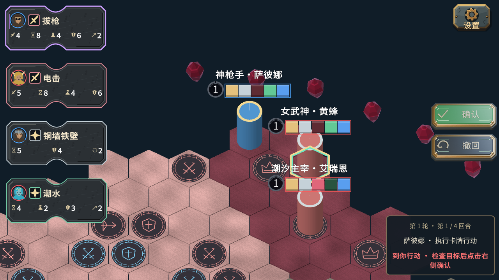
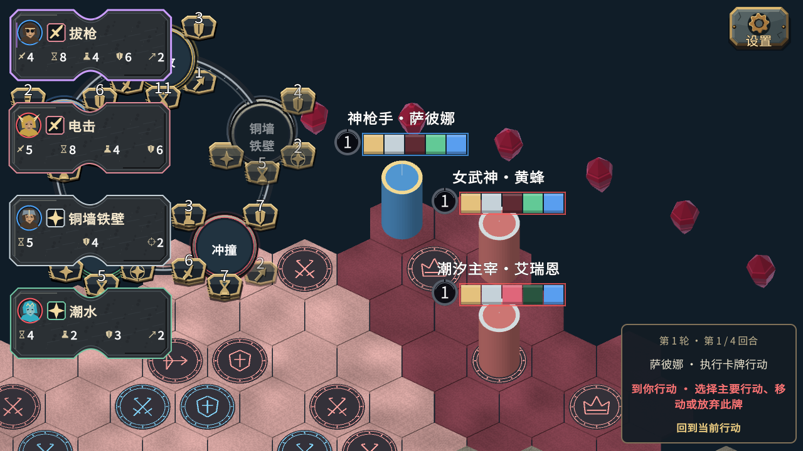

# 紧凑布局与浮雕按钮

用户最新要求覆盖同日上一批右上窗口、独立聚焦开关和按钮叠加文字设计。规则、网络协议和身份未改。

## 完成内容

- 左侧行动石板顶端与左侧约16px等距（保留轻微摆动）；轨道宽度由304—344缩至272—296px，高度136缩至112px。取消底部队伍色条，头像队色边框保留；悬停全文、多级响应、同先攻币和动态排序保留。
- 状态窗统一右下，宽340缩至280px、内边距缩小，移除角色名后的席位括号。旧聚焦按钮和跟随提示弹窗移除。
- 空格与点击右下窗口都调用“回到当前行动”，重复使用仍保持主流程；中键拖动、关闭环、查看其他英雄可进入自由观看。
- 底部主流程提醒条移除。具体步骤补充说明保留在状态窗悬停提示；“步骤选项”入口上移以避开窗口。
- 确认/撤回缩至180×78px，距屏幕右边更近，按钮布局间隙2px（素材本身仍有阴影留白），保留滑入/滑出、倾斜和压下。
- 文字、勾和回转箭头是Blender嵌面上的浮雕几何，随嵌面压下，光照/材质/阴影一次烘焙；Unity没有叠加文字Label。源文件保留两个变体，并打包既有Noto字体；这是中文固定按钮，未来多语言需重新烘焙或使用贴合模型的动态文字材质。

常见游戏UI会把底板、图标和动态文字分层，以便适配语言和分辨率；关键是字体、透视、材质和动画一致。此次两个固定标签按用户要求做成一体浮雕，仍采用轻量烘焙贴图呈现，未宣称运行时物理按钮或最终商业美术质量。

## 验证

- 行动石板Editor 1280×720：202项，包括108张卡的完整悬停文本、数值不越界、反击与多级响应、同先攻交互。原报告 `artifacts/ui3d/audit-1280x720-20261005-155831/report.json`。
- 主流程Editor 1280×720：85项通过；此轮检查后放大了浮雕文字，最终画面以独立Player截图为准。
- 可见独立Player完成主流程检查；最终报告与截图保存在本页同目录的 `compact-flow-20261005`。
- OS键鼠注入12项通过：Home自由观看、空格返回、重复空格不关闭跟随、点击窗口返回、中键拖动及视野不被抢回，所有操作不改变规则revision。不是人工物理键鼠验收。
- Windows x64构建成功，0错误、6警告。未进行四台异地联网验收。

## 失败与修复记录

- Blender曾因用户中文界面下节点名称不同而找不到Principled节点。生成器改按节点类型查找，使用factory-startup并设置python-exit-code，后续烘焙成功。
- 小尺寸浮雕文字第一版偏小，已从模型字体尺寸0.72放大至1.55，再烘焙。
- 隐藏Player运行虽然布局断言通过，但截图为黑图；已改为可见图形测试窗口。审计工具增加PNG采样检查，拒绝纯色/空白截图。旧报告的图片证据已明确纠正，不把黑图记作画面通过。
- OS脚本首轮Home失败，原报告保留。修复按键扫描码及Home的extended标记后12项通过；没有修改游戏快捷键逻辑来迎合错误的注入脚本。

## 画面

## 待用户验收

浮雕按钮的质感、文字可读性及新尺寸；状态窗是否足够简明；多环同时展开时的空间遮挡。测试通过不等于用户美术验收通过。
