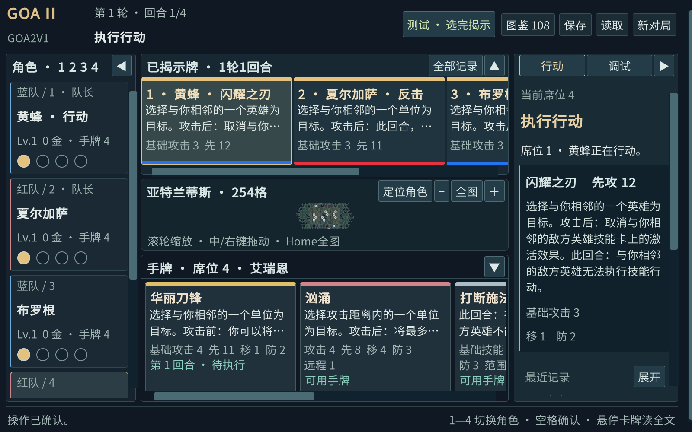

# 队伍颜色条修正验收

日期：2026-09-12。范围：本次四项用户要求中的界面修正、牌效裁定登记、关键词调研及原GitHub项目替换。引擎仍为9，正式卡牌/地图和规则核心无修改。

## 已完成的界面行为

- 揭示牌顶部保留9像素的卡牌颜色条，6像素的红/蓝队伍条固定到卡牌底边，正文及数值区为队伍条预留空间。
- 没有已揭示牌的空位不生成队伍条或牌色条；前三人仅暗选时仍没有队伍条。
- 四人选完后正常显示揭示牌；下一回合暗选前保留上一组公开牌及其队伍条，沿用D-020。不能因尚未选择下一张牌而隐藏仍在展示的上一张牌的队伍信息。



## 实际验证及限制

先增加布局验收，再修改排版。旧版1600×1000实际运行中，空位仍出现色条、队伍条在卡顶；四个状态全部失败。最小修改后，在1600×1000和1280×800分别验证未选、三人暗选、四牌揭示、下回合保留四种状态，均通过。每个席位检查是否应有牌、空位无条、队伍匹配、底边位置、6/9像素高度及与正文/牌色条不重叠。

这些是Unity 6000.3.23f1编辑器Play Mode的真实UI Toolkit排版及截图，以调试准备和命令建立局面；不是独立Player或物理键鼠验收。编辑器审计完成后自动退出，使用独立测试存档。工具和实际输出见[结构化验收记录](队伍颜色条修正结果.json)。

独立Windows程序本次构建成功（0错误，1条既有API弃用警告），但启动被Smart App Control拦截。Windows CodeIntegrity日志2026-09-12 02:56:13记录事件3077/3118；被拦的是本批生成的Goa2V1.exe。因此本批没有独立程序运行通过或独立解压重放通过的结论，也未完成物理键鼠脚本。保留系统策略，使用正常Unity编辑器工作流继续验证。编辑器启动时另有Unity Search索引异常日志，审计仍生成完整结果并正常退出；不是本次卡牌排版异常。

资料/迁移保护验证通过，Python32项通过。未改规则核心，所以没有为此次纯布局变更重跑405项核心矩阵；此前核心测试证据按历史保留。新增反制分支尚未实施，也不计入已通过测试。

## 如何复测

在Goa2V1根目录PowerShell运行：

```powershell
# 本机使用编辑器Play Mode；自动生成独立存档、报告和截图
./tools/test-revealed-stripes.ps1 -Editor -Width 1600 -Height 1000
./tools/test-revealed-stripes.ps1 -Editor -Width 1280 -Height 800

# 独立程序可正常启动的环境；先构建，再执行
./tools/build-unity.ps1 -Task BuildWindows
./tools/test-revealed-stripes.ps1 -Visual
```

不加`-Visual`默认隐藏窗口；`-Editor`明确选择编辑器，脚本不会在独立程序失败后偷偷把编辑器结果当作Player结果。输出目录为artifacts/revealed-stripes，每次独立。完整交互回归仍使用tools/test-readability-ui.ps1，已补充队伍条底边断言，本次未将整套脚本记为通过。

手工检查：新局自动准备后顶端空位无条；1/2/3号选牌时仍无公开条；4号选完后确认牌顶卡色、牌底队伍色不相交；跳过本回合到下一次暗选后仍显示上一组牌。各个有牌/空牌位都应遵循相同规则。

## 本批程序与资料

本机新包：artifacts/releases/Goa2V1-e9-team-stripe-20260912-20260911-190350-c9e44508.zip；SHA256：`fa042b8f93ad4c288418b2aae9162f91683f4a5eef10d86999741d3386861ec8`。打包工具已核对源码清单、程序载荷和哈希，包状态为构建/打包已验证、独立运行待验证。程序包、缓存和本机存档不入Git。

- [近身还击统一调整待办](../planning/卡牌效果调整清单.md)：D-025已记录，牌效暂未更改。
- [关键词调研及推荐方案](../design/卡牌关键词展示调研与建议.md)：提供市场依据、颜色/符号/空格建议及未来验收范围，尚未实施高亮。
- 原GitHub仓库为[yangshuang112358-crypto/GoA2](https://github.com/yangshuang112358-crypto/GoA2)。仓库根目录采用Goa2V1内容；替换前main为`dc625c509b39ca3cc139bcb884260e70463b9733`，作为合并父提交保留其历史。该同步不删除本机v2/v3/v4等历史工程目录。
